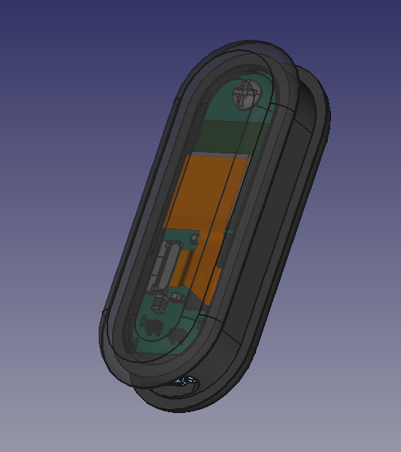

# Herald and Beacons

The Herald API can be used effectively for producing beacons that let passers by know
about a location. This was first used for COVID-19 Venue Beacons, allowing a phone
to create a Venue Diary of where it has been. This is held on device and is thus
privacy preserving. The person could choose to share this with contact tracing teams.

You can see an early mock up of our hardware design below:-

 
<b>Note:</b> An early mock-up of the main module of our DCT wearable, and the first prototype during assembly.
 
 

The beacon data is compatible with existing manual QR code poster scanning systems
like the one invented by New Zealand and subsequently adopted by many countries,
including the UK, for public check-in.

The Herald Venue Beacon approach has significant benefits:-
- No need to print and keep replacing posters
- As well as public safety, the beacons can be used to facilitate navigation within a complex environment (E.g. Hospital or shopping centre)
- Automatic logging, not requiring manual user QR code scanning
- As well as check-in, the venue diary also logs check-out, and thus false positive notifications which are common with a QR code solution are avoided. This could happen when visiting a store at 0800 and then later at 1200 a person who is later found to have COVID-19 causes all people to be notified to self isolate and get tested. Clearly there is very little correlation between two visitors to a store hours apart, and so venue check-out has significant advantages.

## Onward development

The Herald team are currently linking the Venue Beacon concept to our
[Bluetooth MESH](/applications/mesh)
capability. This will allow remote management and over-the-air software
updates of a large number of beacons in a complex environment such as a large
restaurant, football stadium, school, hospital or shopping centre.

## How to get started with Beacons

Currently there is no standard application built for mobile phone users to interact
with Herald beacons, but you can add Herald support to your existing mobile app
quite easily. See the 
[Herald Development Guide](/guide) 
for details.

## Base model - Bluetooth Tag and Beacon

The based model features just a main board. An estimated production cost of USD 20, or USD 25 with a basic case. Cost could be reduced by USD 5 if optional hardware is removed.

This includes the following hardware:-

- Fanstel BC833M module certified for Bluetooth and NFC, based on the Nordic Semiconductor nRF52833 module QDAA (Arm Cortex M4F) with 128 KB RAM
- Bluetooth and NFC antennae
  - NFC is used as an 'out of band' authentication mechanism during provisioning, which could instead be done via USB
- RGB+IR light sensor - To detect daylight vs artificial light (I.e. indoors versus outdoors)
  - Could be removed to reduce production cost
- Accelerometer - To detect when the device is not moving not in use, to help save power. Could be used in future to determine how often tagged equipment is used.
- Real Time Clock and Calendar chip - To maintain date and time, vital for security functions
- 2 MB of external storage - For storing updates or other equipment environment data such as vibration data (The nRF52833 has an onboard 512 KB Flash for application/Zephyr RTOS data)
  - Could be removed to reduce production cost
- USB-C connector (waterproof) for power and data transfer
  - Could be removed to reduce production cost, with all programming and updates done via Bluetooth Low Energy or Bluetooth MESH