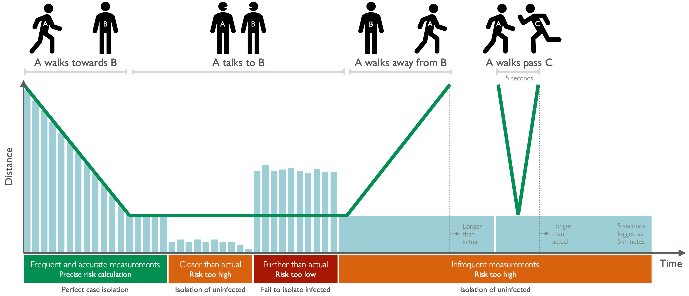

# Herald and Contact Tracing

Herald was originally created to solve the problem of very variable and unreliable
Bluetooth mechanisms on Android and iOS devices. Over 40 techniques and workarounds
are present in how Herald works.

As it turns out these same problems are also applicable for a wide range of
[other applications]({{"/applications" | relative_url }}).

Herald supports over 98% of phones worldwide - this includes phones that do not
support advertising their presence themselves. Many contact tracing protocols in
use today fail to take this scenario in to account, meaning they miss around
35% of all Android phone users.

Reliability of the Bluetooth stacks within Android and iOS is also very questionable,
requiring exact protocol use and testing to workaround. This takes application
developers away from solving medical and epidemiological problems. By using Herald,
these teams can again concentrate on their residents and patients and leave
the reliable Bluetooth messaging and range finding to Herald.

## Herald solves risk estimation problems

Other Digital Contact Tracing (DCT) protocols don't often checked for nearby devices. When they do check, then
often don't make regular calculations using all available data for distance estimation. Even when they do,
some then don't provide this raw estimate to a DCT app - instead providing very rough buckets of exposure.

For digital contact tracing this can lead to devices not being recorded at all, or under and over estimating
risk by large amounts. If a DCT app is being used to advise people to self-isolate in case of exposure this
high 'false positive' rate will lead to the loss of trust in, and compliance to, pandemic health advice.

Thankfully with Herald there's a much better way. Herald uses every single advertisement each device
sends out. These range from 5 times a second to once every 5 seconds. Most other applications only scan
for devices at best every two minutes! This means Herald picks up a lot more of detections allowing us
to provide data sooner and more accurately.

Herald also tunes which devices to talk to. If its a device it has exchanged the payload with before then it
doesn't do so again. It also filters out non-Herald devices, reducing the amount of battery used and
preventing interference with your Apple TVs, smartwatches, or car stereo systems.

 
<b>Note:</b> The above figure shows the effects of under and over estimating exposure risk.
 
 

## All about contact tracing

Please see the [Contact tracing introduction]({{"/background" | relative_url }}) 
for a discussion of the many issues with manual and mobile contact tracing.

## What does Herald provide?

The API itself provides a reliable [Protocol]({{"/protocol" | relative_url }})
for exchanging information. You can either use your own or one of our suggested
[Payload specifications]({{"/payload" | relative_url }}) on top of the Herald
protocol.

## International Interoperability (As of v1.1)

By adopting the [Herald envelope]({{"/payload/envelope" | relative_url }})
for your contact tracing app (supported by all our suggested payloads) you
will ensure that wherever your country's residents travel to, their application
can be used as-is internationally. We recommend the 
[Secured payload]({{"/payload/secured" | relative_url }})
in this instance.

## Automated check-in (As of v1.2)

Using the new [Herald Beacon Payload]({{"/payload/beacon" | relative_url }})
a phone supporting the detection of Herald Beacons (but using ANY contact
tracing protocol) can build up a diary of check-ins and check-outs from
venues. 

This means people don't have to remember to scan QR codes for locations which is
error prone. Multiple beacons can be placed in big venues, hospitals, or company
campusses with specific area names to provide more fine-grained exposure
notifications. 

Herald Beacons also track the full time from check-in to check-out
to minimise false exposure notifications to wrong people who happened to turn up
on the same day, but at different times and areas within a venue, to people who
were ill.

## Wearables (As of v1.3)

For younger school children without phones, or for the elderly too, a contact
tracing solution is needed. A cheap [Bluetooth enabled wearable]({{"/applications/wearable" | relative_url }}) is a good solution
here. This may or may not be backed up by a local Bluetooth mesh network
to reduce the cost of the end device.

We are implementing Herald in C++ for Windows and Embedded use cases. Our first
target platform will be Nordic Semiconductor nRF52840 usb dongles for our
reference implementation. This uses the Zephyr open source real time operating
system (RTOS). This is currently in Alpha development.

## Sample applications

We currently have the following sample applications that can be used as inspiration
for your own digital contact tracing applications:-

- [C++ Venue Beacon](https://github.com/vmware/herald-for-cpp/tree/develop/herald-venue-beacon) - Tell nearby phones that they're in a particular venue, and even which area within the venue
- [C++ wearable DCT](https://github.com/vmware/herald-for-cpp/tree/develop/herald-wearable) - A basic design for a DCT app like those for iOS and Android, but on a dedicated hardware device
- [iOS demo app](https://github.com/vmware/herald-for-ios/tree/develop/Herald-for-iOS) - Demonstrates low and mid level functionality useful for DCT, including Venue Diary support and social mixing score
- [Android demo app](https://github.com/vmware/herald-for-android/tree/develop/app) - Demonstrates low and mid level functionality useful for DCT, including Venue Diary support and social mixing score

Note: These are NOT production quality applications with full functionality as that would require an appropriate PHA-controlled backend set of services.