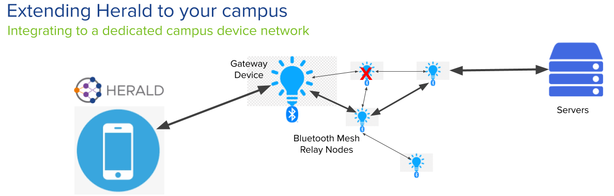

# Bluetooth Mesh applications (Coming soon)

Bluetooth Mesh is a standard part of Bluetooth 5 that allows
many enrolled devices (not consumer devices like phones) to act together
as a web of communication for small but high frequency messages.

This technology does not have a recommended Gateway protocol to bridge the
gap between individual consumer devices and the services and message topic
subscriptions and notifications available via Bluetooth Mesh.

Herald can act as the Gateway protocol on the Bluetooth Mesh Proxy Nodes.
This allows consumer devices to move all around a location, or campus,
and remain connected to that locations messaging systems.

Below is an example diagram of how Herald can help:-

This is potentially useful in areas where 4G/5G, WiFi, or other radio
signals find hard to penetrate, or are very expensive to roll out.

Bluetooth mesh nodes can simply be rolled out as specially modified
lightbulbs. No other infrastructure is necessary.

Such a network allows consumer devices to talk end to end, or
central servers to be connected and provide useful services, such
as reliable messaging.

## Find out more

For full details, see our [Herald Bluetooth MESH](/mesh)
documentation pages.