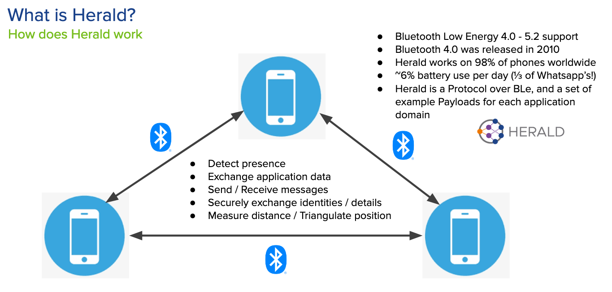

# Point to Point applications (Since v1.0)

The primary use case for Herald is for point to point (P2P) mobile Bluetooth communication.
This is the capability used for Contact Tracing and other device-to-device use cases.

Below is an example diagram of how Herald can help:-

In this scenario Herald provides both direct and intermediary (calling card) payload
exchange.

## Optional features

Herald also provides some optional features.

### Payload exchange frequency (Since v1.1)

By default Herald presumes that the Payload exchange is an identifier only,
persistent and so exchanged only once per Bluetooth MAC address rotation.

It is possible to vary the frequency of exchange. We have tested this to
once every 30 seconds too. This is useful where the exchange wire data changes
due to wanting to prevent relay and replay attacks, encrypting the data
differently every 30 seconds.

This is a mechanism used by our
[Secured Payload]({{"/payload/secured" | relative_url }}).

### Immediate Send (Since v1.1)

For some applications an occasional pointed data send is required. This is
useful for applications that need to send an immediate, quick as possible,
timing signal once rather than regularly every so many seconds or minutes.

Currently the SensorArray.immediateSend(Data, TargetIdentifier) function
allows an application to safely bypass the Herald signal loop. It will
connect to the device if not currently connected, send the signal, and
disconnect.

We also support a SensorArray.immediateSend(Data) function that will
send to all devices, but only those already currently connected.

Herald does not inspect the data to be sent, just wraps it and sends it safely
in a way that does not introduce performance or reliability issues in other
aspects of device to device communication.
