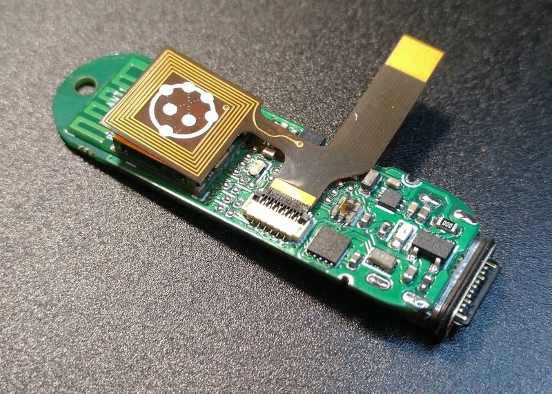

# Herald and Wearables

Herald has a [C++ API and demo applications](https://github.com/theheraldproject/herald-for-cpp) that showcase
how a low-cost but high performance eHealth wearable can be developed.

Our first wearable sample application is for 
[Digital Contact Tracing (DCT)]({{"/applications/ct" | relative_url }})
and provides the same DCT functionality as our iOS and Android Herald API and sample applications.

This also works well with our Venue Beacon, logging both nearby contacts and when you visited
restaurants and bars - both check-in and check-out time - and storing them on your wearable.
You can then choose to later share these with contact tracers.

## Opensource hardware

We are also working on an opensource hardware design that will be published shortly in Herald v2.1.
You can review our work on this at the [Herald Hardware GitHub repo](https://github.com/theheraldproject/herald-hardware).

The focus of this design is to minimise the cost of producing DCT solutions for use by those
who cannot afford $1000 smartphones, for young and old people without this technology, and
for parts of the world without the infrastructure to support a traditional DCT system.

You can see our first prototype below:-

 

The hardware is licensed under the CERN Open Hardware License - Permissive - Version 2. This allows it to be used as the basis of
both opensource and commercial wearables.

These wearables are designed to work with an owner who has a mobile phone with Herald installed to provide an uplink, or in a 
healthcare setting with DCT walk-by beacons, such as in an office, cruise ship, or healthcare setting. This is useful for people
who either do not have a phone, or who cannot always use a phone, such as construction workers.

## Base model - Bluetooth DCT

The based model features just a main board. An estimated production cost of USD 20, or USD 25 with a watch strap and case. 

This includes the following hardware:-

- Fanstel BC833M module certified for Bluetooth and NFC, based on the Nordic Semiconductor nRF52833 module QDAA (Arm Cortex M4F) with 128 KB RAM
- Bluetooth and NFC antennae
- RGB+IR light sensor - To detect daylight vs artificial light (I.e. indoors versus outdoors)
- Accelerometer - To detect when the device is not worn and not in use, to help save power. Could be used in future for a step counter too.
- Real Time Clock and Calendar chip - To maintain date and time
- 2 MB of external storage - For storing exposure risk accrual data (The nRF52833 has an onboard 512 KB Flash for application/Zephyr RTOS data)
- USB-C connector (waterproof) for power and data transfer

## eHealth monitoring model

There's a cable to plug in a variety of daughter expansion boards. The first board is designed for health monitoring to spot medical problems, such as low blood oxygenation, emerging over time. An estimated production cost of USD 30, or USD 35 with a watch strap and case. 

This model features these additional sensors:-

- Skin temperature sensor
- Pulse rate and blood oximeter sensor

## Future Watch variant

We are currently evaluating opensource options to see whether a higher end device can be modified to include Herald, for those who want an opensource smartwatch and digital contact tracing with eHealth monitoring. We hope to share more after initial research has been completed.