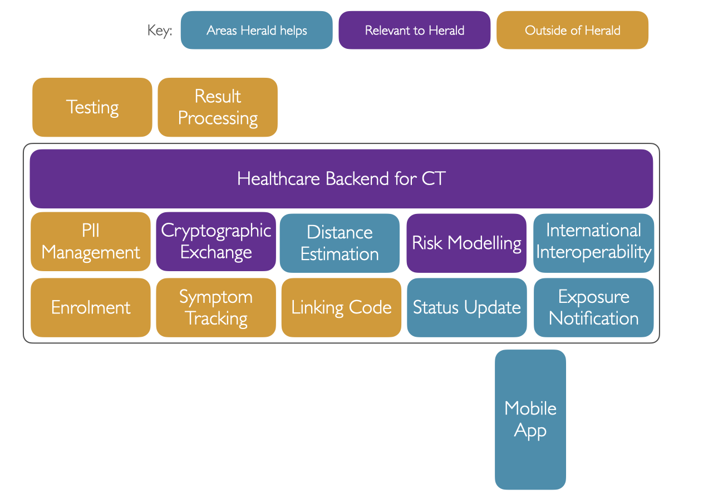

---
# Feel free to add content and custom Front Matter to this file.
# To modify the layout, see https://jekyllrb.com/docs/themes/#overriding-theme-defaults

layout: page
title: What is Contact Tracing?
description: Background to contact tracing, proximity detection, and distance estimation
menubar: docs_menu
---

# About Contact Tracing

Contact Tracing is not a new process. It is about asking an individual who has fallen ill to
list the people and places they have been to in order to find, isolate and test other
people who may be ill before they can spread a particular illness more widely.

What is new is using technology to perform Contact Tracing. A team from Cambridge first
did this for a Flu outbreak in the mid 2000s. This used an older version of Bluetooth
which was power hungry and so was not more widely adopted at the time.

In 2020 many worldwide teams are developing [Bluetooth Protocols](/protocol) to 
perform mobile app based contact tracing. This involves having an app running on your
phone that is constantly talking to other nearby phones during the day. By swapping
identifiers these phones maintain a virtual, and pseudoanonymous, list of your contacts.

Below is a diagram showing elements of a contact tracing system beyond just the app:-

## Benefits of mobile contact tracing

Mobile contact tracing helps in many situations where manual contact tracing cannot.
Consider a situation where you were sat in a coffee shop with a friend but also nearby
many other customers. You would not be able to tell manual contact tracers who you
had been near to, and that shop would not be able to notify all of its customers. By
having an app running on peoples phones though you would not need to. The contact and
relative distance would be logged.

Logging relative distance also provides a richer set of data in order to estimate
risk upon. An app can also accurately measure the duration of a contact rather than
rely upon human memory. This too makes the risk calculation more accurate than relying
on human memory.

Some diseases, like COVID-19, also have a very long period where you can be spreading
the disease prior to showing symptoms. COVID-19 has a 95 percentile probability of showing
symptoms only by the 14 day period. This places a very large burden on human memory
especially for those with busy lifestyles that commute and meet regularly. These people
are also those moving about most, and thus are most likely to widely spread a disease.

There are also edge cases where a psudeononymous app is beneficial. People at risk of
domestic violence if they reveal their movements in an interview that is overheard is
one risk. Another is that of super spreaders. These people more readily pass on
diseased than others. It could be a simple brief encounter of passing them on the
street that infects you. In such a circumstance no manual contact tracing method
could help - you simply pass too many people on the way in to an office to trace.

Interventions can also be aimed at individuals who are at risk rather than pre-emptively
locking down entire groups of workers in an office, whole towns, or states. In a
centralised system health authorities could also garner information on general population
mixing in specific towns and track a virus' spread in advance of people falling ill.
App based contact tracing can therefore be very useful in prevention.

Whilst app based contact tracing is unlikely to replace manual contact tracing, it
is certainly a very useful and specific instrument in the hands of a health authority.

## Problems with mobile contact tracing

Clearly if an app was sharing very personal information like your name and healthcare
identifier as you were walking around this would be a very big privacy concern. 
Mechanisms have to be used that preserve the privacy of an individual.

Pseudononymous identifers, rotating keys, and encryption are all methods used within
contact tracing applications. Whether these are associated with any healthcare identifier
or personal information is a decision best left to particular societies. 

In our
[Payload](/payload) specification we suggest a general payload that can be used for
both centralised and decentralised approaches, with or without linking to a healthcare
identifier. This also supports international interoperability. Using such an approach
will allow local countries to make their own decisions on where to draw the line
whilst allowing for a maximal health response.

Also clearly an issue is having a device that is capable of running a particular
protocol. Our [Protocol](/protocol) supports 97.5% of the population and the handsets
they use. Other protocols relies on particular technologies, or mobile operating system
versions, that greatly reduce this reach by 30%.

Also anything electronic has battery life issues. Bluetooth Low Energy since June 2010
has much lower battery use. It's important to take regular
distance estimations in a contact tracing app, but also to not do so often
enough to run the battery down. A full day needs to be supported. 
[Our protocol](/protocol) has been shown to only drain the battery by 6-11% over
an 8 hour day. That's less battery use than WhatsApp on your phone!

Western countries like the UK have a population where 98% of people own a 
phone with Bluetooth Low Energy support. In other countries this will be lower, which
is why manual contact tracing is still important.

## How does mobile contact tracing work?

The idea is that people run an app on their phone and keep it running at all times
in the background as they go about their business. During the day this phones is regularly
advertising the fact it's running a contact tracing protocol to other devices nearby.
Non contact tracing apps ignore this advertisement, but other contact tracing apps
are specifically looking for it.

When another phone discovers this advertisement it will record the pseudonymous identifier
of the other device and then regularly take distance estimation readings. Using Bluetooth
this is done by using the RSSI signal strength indicator. These readings are then stored
locally on the phone for around 14 days.

When someone with an app falls ill they are asked to share their status and recent identifiers.
These are then matched against others' recorded data to determine others' risk exposure.
Any people who exceed a particular risk threshold will typically be given advice
to self isolate and get tested.

## Centralised or Decentralised

There have been two terms that aim to describe contact tracing approaches. These are
centralised and decentralised. Every contact tracing system necessarily has a central
server to link an individual (whether identified by name or healthcare ID or not)
back in to the health service. What "Decentralised" actually means is "Ensuring the
health authority cannot have a full contact graph such that this information can be
abused by another part of the State apparentus". E.g. for restricting freedom of
movement or assembly, or law enforcement location/social tracing.

How contact matching occurs depends on whether the app uses a centralised or decentralised
approach. In a decentralised approach all matching occurs on individual phones, with
no proximity information shared with a health authority. Many privacy advocates
prefer this approach.

The downside of the pure decentralised approach is as follows:-
- It provides no advance information to the healthcare system of a particular country
as to the mixing and spreading of a disease prior to a person getting diagnosed
- The data cannot be mined to determine if the 'risk alert threshold' in a particular
country, or part of a country, is at the right level to reduce virus spread making
it hard for countries to determine the right balance between lockdown advice and risk
- Decentralised approaches cannot spot 'asymptomatic' individuals - people who are
ill with the disease, and spreading it, and should be directed to a health professional
- Decentralised approaches cannot spot 'super spreaders' prior to their own
diagnosis as they don't provide multiple device's contact graphs to a central
location where they can be analysed for such patterns in advance
- Only first-order contacts can be notified. At the height of a pandemic you may
wish to reach out to second or third order contacts in order to lock those down
until they are tested in order to drastically cut the spread of the virus
[Some studies (PDF, Oxford)](https://github.com/BDI-pathogens/covid-19_instant_tracing/blob/master/Report%20-%20Effective%20Configurations%20of%20a%20Digital%20Contact%20Tracing%20App.pdf) 
have been done on this and show this can drastically cut the
spread of a virus. Whilst wide ranging, this would provide a level of control 
before requiring a full national lock down
- In a decentralised system you cannot verify that a device saying they are 
infected and have had a myriad of contacts is real, or that a contact graph
is real. This allows hostile state actors potentially to use devices in particular
areas to lock down individuals, important buildings/organisations, or as has
been [reported recently (Website, Forbes)](https://www.forbes.com/sites/michaeldelcastillo/2020/08/27/google-and-apple-downplay-possible-election-threat-identified-in-their-covid-19-tracing-software/) 
prevent them from going to the polls
- International interoperability - Whilst every government could adopt the same
physical protocol and thus be technically compatible, it should be noted that
each jurisdiction maintains its own list of ill contact identifiers even in
decentralised protocols. This means a French app wouldn't see the UK's list of
ill people, so people mixing between countries wouldn't be notified of any
risk they are being placed at, and governments would not known without manual
contact tracing where sick people were travelling from. This is particularly
an issue in areas where people regularly cross a border, such as that between
Ulster and the Republic of Ireland.

A centralised system allows all of the above problems to be countered.

It is up to individual governments to decide which level of risk is more of
an issue to their populations.

Our suggested [Herald Secure payload](/payload/secured) strikes a middle
ground here, providing a predictable ID and graph to the state, but with only
one side of the contact graph shared. (When the ill person submits their data)
This approach also counters spoofing, relay, and replay attacks and is more
secure than the pure decentralised approach.

## What does mobile Contact Tracing comprise of?

There are several steps. They are as follows:-

- Detection - Seeing another phone running an app, and logging the owners 
pseudononymous identifier
- Proximity Ranging - Regularly providing distance estimations during a 
Contact Event. The more regularly this is done, the more accurate the risk
estimation
- Risk exposure calculation - how much risk has been ocurred 
(a function of distance and time)
- Tracing - Taken an ill person's log of information and/or identifier
and using this to calculated the risk of others' exposure to this person,
and providing advice for them to take (E.g. isolation and testing)

The first two points are generally grouped and called 'Proximity Detection'
and are the purvue of the [Herald Protocol](/protocol) and [Payload](/payload)
of a particular Proximity Detection Protocol.

Distance estimation has been out of scope of our research, but we have
made [some distance estimation discoveries](/bluetooth/distance).

The final one, Tracing, and how it occurs is determined by the mobile
contact tracing application using the protocol that is provided to a
particular state or countries residents.

Below is a diagram of an end to end contact tracing system flow:-

