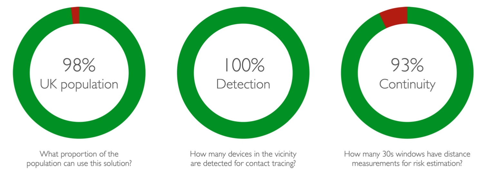

# Core Design

Herald has been created for contact tracing, thus its requirements and characteristics have all been derived from peer reviewed epidemiology research (Ferretti, et al., 2020). The core design philosophy is therefore to ensure the efficacy of the technical solution is assessed against all relevant aspects of epidemiological requirements (Fowler, 2020). The guiding principles in the design of Herald were:

- Mass adoption is crucial to the success of a contact tracing app, therefore eliminate all technical and social barriers to maximise deployability and user acceptance. This was achieved by (i) reducing software requirements down to iOS 9.3 and Android 5, (ii) enabling detection of interactions for non-advertising Android phones, (iii) enabling indefinite background operation on iOS and Android with no user action, and (iv) ensuring battery drain is down to 2% per hour.
- User compliance to app instructions to quarantine is dependent on public trust. This is achieved by (i) formally evaluating and publishing the efficacy of the technical solution according to epidemiological requirements to demonstrate its effectiveness and be transparent about its limitations, and (ii) publishing all the code, tools, test results, and documentation for inspection, independent evaluation, and security reviews.
- Accurate case isolation is essential for disease control and limiting the social economic impacts. This is achieved by (i) detecting all app users in the vicinity, (ii) delivering at least one distance measurement every 30 seconds for precise exposure risk estimation, and (iii) providing measurements continuously, consistently, and indefinitely for all app users.
- Most nations would prefer to use their own payload data for device identification, as this is a core component of their app security design. This is achieved by (i) delivering a generic protocol that only acts as a reliable data transport which is payload data agnostic, (ii) ensuring the design is applicable to both centralised and decentralised approaches, (iii) providing a common payload data wrapper for routing payload data without inspecting the content to enable interoperability across nations, and (iv) offering a reference implementation of a secure payload for adoption by nations without their own solution.
- Our understanding of COVID-19 is rapidly evolving, therefore the solution needs to be rapidly adaptable to take advantage of scientific advances. This is achieved by (i) keeping the protocol generic for simple interaction logging and distance estimation which is solution agnostic, (ii) delivering all raw measurements (RSSI, or received signal strength indicator) for analysis and distance estimation by the app, (iii) adopting the fastest possible sampling rate of circa 8 seconds to maximise duration measurement accuracy, and (iv) using a low energy sampling method to minimise impact on battery drain to ensure user acceptance.

## Epidemiological constraints

This section is mainly relevant to contact tracing apps, but the same holds true of any 'exposure' or 'other device is nearby' scenario.

Herald aims to deliver a technical solution according to epidemiological requirements. Analysis of epidemiological research and simulation models (Ferretti, et al., 2020, Hinch, et al., 2020, and Qureshi, et al., 2020) has shown the key technical parameters for consideration from an epidemiological perspective are population reach, efficacy and adaptability. Figure 2 presents a summary of the impact of app efficacy on case isolation and disease control.

### Population reach

Ensuring the vast majority of the population can use the app, as an interaction involves two people, thus any barrier to adoption on one person has a significant impact. For instance, GlobalStats (Statcounter, 2020) data shows 68.02% of iPhones in the UK are running iOS 13.5 or later, thus only 68.01% x 68.02% = 46.27% of interactions between iOS-iOS devices are captured if the app requires iOS 13.5 or later. In contrast, Herald runs on iOS 9.3 or later, which covers 99.38% of UK iPhones, thus it captures 99.38% x 99.38% = 98.76% of interactions between iOS devices.

### Efficacy
Ensuring all other app users within 8 metres are detected, and the distance and duration of exposure is accurately captured by the app throughout an encounter of any length. Case isolation decisions are taken based on proximity and duration measurements in magnitudes of minutes and metres (e.g. exposure of 15 minutes at 2 metres). Exposure risk is cumulative, thus an
infection may stem from one long exposure, or the combination of many short exposures. For this reason, precise measurement of duration, achieved by a high sampling rate, is essential for precise risk estimation.

Herald will aim to take a sample once every 8 seconds but the sampling rate may degrade to once every 30 seconds when there are many devices in the vicinity. Distance estimation based on RSSI is inaccurate (Leith and Farrell, 2020), although accuracy is improved by taking additional samples, and also the precise translation from RSSI to physical distance remains an active area of research, therefore Herald aims to take as many samples as possible, and delivers the raw RSSI measurements for analysis by the app to take advantage of latest advances in distance estimation.

### Adaptability
Our understand of COVID-19 is fast evolving, thus an app, in particular, the underlying data analysis algorithms are likely to change frequently over time. A centralised approach will enable rapid change, where the app acts as a simple data logger, and the central server acts as the intelligent decision maker for case isolation based on latest scientific knowledge. However, a centralised approach may be unacceptable in some countries, thus the intelligence may be incorporated into the app itself for decentralised operation. Herald will support both centralised and decentralised approaches. The solution has been kept as simple as possible to ensure changes to our understanding of COVID-19 is unlikely to impact the protocol implementation for the foreseeable future.

## Device support

Herald offers at least one RSSI measurement every 30 seconds for every iOS and Android device running the Herald protocol within 8 metres. Tests have shown Herald is able to achieve this service level in 93% of 30 second windows (continuity metrics, see Fowler, 2020) while ranging for 10 devices simultaneously. In practice, the sampling rate is much higher, often taking several measurements every 8 seconds, especially when there are fewer devices in the vicinity. Test results have shown Herald can achieve 96.24% continuity for 9 devices, 99.58% continuity for 3 Android devices, and 100% continuity for a pair of iOS devices. These tests ran for 10 to 20 hours. The detection range of Herald is also much greater than 8 metres in practice, as Bluetooth (BLE 4.0) range can be up to 100 metres.

The cross-platform solution is compatible with 98.0% of UK smartphones and 97.5% of smartphones worldwide. Detailed analysis of smartphone OS adoption has shown Herald is compatible with over 97% of smartphones in many countries, including Germany (97.7%), France
(97.9%), India (98.2%), Australia (98.3%), New Zealand (98.3%), and USA (98.8%). Compatibility is lower in some countries, such as Kenya (88.3%), due to a large population using older Android phones without OS support for BLE, but compatibility is still sufficiently high for disease control according to epidemiological requirements.

This detailed design aims to provide a comprehensive description of the protocol to facilitate design and security reviews. The section will start with a description of the data items being handled by Herald, and then the protocol is presented as an overview, before expanding to platform specific details. This is necessary because the conceptual protocol is easy to understanding but the implementation details are complex due to iOS and Android constraints.

Next: [Data in Herald]({{"/design/data" | relative_url }})
