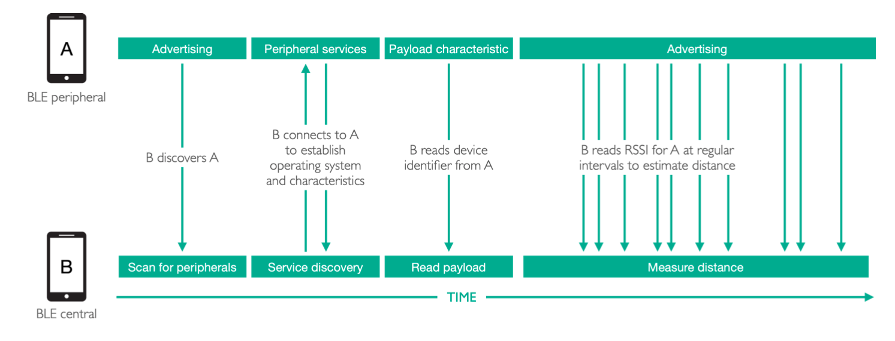

# Data captured and used

There are three types of data in Herald:-

1. Bluetooth level data - such as Bluetooth MAC address, RSSI, services advertised
2. Protocol data - information exchanged as part of how Herald devices communicate
3. Payload data - the data that Herald exchanges between devices

It is important to note that the Herald protocol supports any data as its payload.
This allows it to be used for centralised, decentralised, or hybrid Contact Tracing
applications, but also for any application requiring reliable data exchange
over Bluetooth, in any industry. This makes Herald very flexible within and
beyond a healthcare setting.

## Bluetooth data used

The information items being handled and shared by Herald are as follows:

1. RSSI measurement for estimating distance between two devices. This is the RSSI value reported by the device operating system, taken from the Bluetooth hardware.
2. Payload data for device identification. This is a permanent device identifier allocated by the contact tracing app for sharing between devices to enable contact tracing. Payload data is expected to be encrypted by the app, Herald simply acts as a reliable transport for sharing the encrypted data between devices.
3. Bluetooth device address for communication between two devices. This is a randomly generated address allocated by the operating system. The address is changed by the operating system at regular intervals to enable short-term addressing and communication between devices while avoiding long-term tracking. The frequency of address change is determined by the operating system, which can be several seconds to over 20 minutes.
4. Manufacturer identifier for recognising all iOS devices in background (and foreground mode), and also Android devices advertising Herald services. This is a fixed identifier that is common across all devices for a manufacturer. For iOS, it is always the fixed identifier for all Apple devices. For Android, it is a customisable identifier, thus a custom identifier is used by Herald to indicate the device is advertising Herald services.
5. Pseudo device address for efficient payload data sharing between devices. This is a randomly generated address allocated by Herald. The address is changed by Herald at fixed intervals (every 15 minutes) to supplement the Bluetooth device address that can rotate at any frequency. Without this pseudo address, a device that changes its Bluetooth address every few seconds will appear as a new device in every scan, thus requiring Payload data exchange every few seconds, which is wasteful and impacts performance. The pseudo address is the same length as the Bluetooth address, thus there is no reduction in privacy or security. The data is encoded in the manufacturer data area of the Bluetooth advert for Android devices only. iOS devices changes its Bluetooth address at roughly 15 minute intervals, according to Bluetooth specification, thus it is unnecessary to include a Pseudo address; besides, iOS does not allow customisation of the manufacturer data in iOS adverts.

On iOS devices, GPS location monitoring and iBeacon ranging have been implemented as optional capabilities that are disabled by default. Enabling location monitoring and beacon ranging has the benefit of also enabling direct iOS-iOS detection and ranging in background mode, without relying on an Android device in the vicinity. This is a design feature of Herald that takes advantage of an undocumented iOS operating system behaviour, where iOS background adverts are detected and read if (i) location monitoring is enabled, even at 3km resolution will suffice, (ii) beacon ranging is active, even if the target beacon is fictional, and (iii) the device display is lit, even for a moment. In other words, enabling this feature does not impact user privacy as GPS location is not being updated, and the target beacon is fictional, thus no location data is being recorded by the app.

Herald includes a collection of data loggers that writes device data, detected target devices, payload data, and RSSI measurements to CSV files for analysis, as well as application loggers for debugging purposes. All these loggers are optional and should be disabled in a production solution. They are only used for development and testing, and to facilitate independent evaluation of Herald using the same test procedure and tools as the development team for review and quality assurance. Herald is inherently a stateless component with no persistent storage. It has an in-memory data store for collating and caching device data for efficient handling of asynchronously acquired data; this data store is purged regularly, at least once a minute, to discard information about devices that have been out of range for an hour.

## Protocol data overview

Herald is activated and deactivated automatically according to the Bluetooth state of the device. When Bluetooth is on, Herald will be active, and it will scan for other devices advertising Herald services. Once a device is discovered, it will measure RSSI of the target device at regular intervals, offering at least one measurement every 30 seconds, and also obtain the Payload data of the target device as soon as possible to facilitate contact tracing. The result of these device discovery, RSSI measurement, and read payload events are reported to the app via callbacks for processing. Herald does not maintain a permanent database of device data, that is the app’s responsibility; it only maintains a transient cache of device data for efficiency.

Figure 4 presents the conceptual design of Herald, showing how a smartphone acting as a BLE central as well as a BLE peripheral to enable Payload data exchange and RSSI measurements. Please note the diagram only shows each smartphone acting as one of the two roles for clarity, in practice both phones shall take on both roles where possible. Furthermore, BLE is inherently asynchronous, thus the exact sequence of events may vary, specifically, RSSI measurements may be taken before the Payload data is read from the target device.

The complexity of Herald stem from the cross-platform nature of the protocol, where efficient, reliable, and regular proximity measurements can only be achieved by overcoming platform specific challenges with cross-platform solutions. As such, the protocol description will start by offering a cross-platform overview, followed by platform specific descriptions for clarity.

Herald has the following stages in its communication.

### Scan for peripherals

Herald will initiate a device scan up to every 8 seconds, to discover other devices in the vicinity that may be running the Herald protocol. Once a device has been discovered, the operating system callback will provide the Bluetooth device address of the target device, the RSSI measurement for the device, and the BLE advert data, where the Manufacturer identifier, and optional Pseudo device address can be extracted. All information about a device are cached in a transient in-memory data store that is purged at least once every minute, to delete devices that have been out of range for an hour. Bluetooth communication is asynchronous, thus discrete information items about a device are gathered asynchronously and collated over time. The in-memory data store offers a mechanism for collating device data over time, and also avoiding repetition that impacts efficiency. Herald does not incorporate a persistent store by design, except for a set of optional loggers for recording data for analysis.

### Service discovery

Upon discovery of a device, Herald will aim to complete a set of tasks according to current priority. The highest priority task is to check if the target device offers Herald services, and also establish the operating system of the target device. This is achieved by connecting to the device, searching for a fixed Herald service identifier, and if found, interrogating the service to seek a set of fixed Herald service characteristics. Herald expects to find two characteristics, (i) a read-only payload characteristic for acquiring the target device’s current Payload data, and (ii) a write-only signal characteristic for transmitting data to the target device. The latter is used for a range of platform specific purposes that are described in the following sections. The operating system of the device is resolved by the signal characteristic as the characteristic identifier is different for iOS and Android devices.

### Read payload

Once the payload characteristic has been discovered, Herald will aim to obtain the Payload data from the target device as soon as possible. This is not always instantaneous because reading data from a target device takes time, thus given a large collection of new devices in the vicinity, the combined time will exceed the preferred distance sampling rate of at least one RSSI measurement every 30 seconds. As such, read payload may be deferred to the next scan cycle to ensure distance measurements are taken as regularly as possible for all devices, hence the need for caching device data and adopting a priority based approach in managing asynchronous device data acquisition processes.

### Measure distance

For every device within Bluetooth detection range, Herald will aim to take a RSSI measurement at least once every 30 seconds for each device to offer accurate proximity and duration measurements for risk estimation. The process for taking regular distance measurements continuously for each device differs for each pair of platforms. This will be elaborated in the platform specific descriptions.

### Delete data

Herald expects devices to move in and out of range, and also move out of range permanently. The in-memory cache is inspected in every scan cycle to purge devices that have been out of range for at least an hour. This is necessary as Herald is not designed to be a persistent store, thus it will delete data as soon as it becomes irrelevant. It is the responsibility of the contact tracing app to store the Payload data, RSSI measurements, and generate a timestamp for these events for contact tracing. Please note, the optional loggers provided with Herald can all be disabled, and code logging can also be fully disabled, thus making Herald an in-memory stateless component.

Next: [Protocol Lifecycle]({{"/design/protocol" | relative_url }})