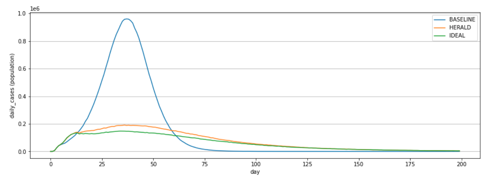

# Design Guide

This section describes how Herald is designed, and the rationale for design decisions.

Herald can be thought of as a 'Layer 7' (Application) protocol. It sits on top of
any Operating Systems's Bluetooth Low Energy 4.0 or above protocol stack and uses
a small subset of functionality in order to provide reliable discovery, data
exchange, and (optionally) distance estimation between Bluetooth devices.

Thanks to this design Herald is Bluetooth compliant and does not use any non-standard
features of Bluetooth.

The following pages detail the full design rationale for Herald.

## Introduction

Herald is a free and open source cross-platform protocol for proximity detection. It was created to enable all countries, regardless of wealth and technical capability, to control the COVID-19 pandemic with automated contact tracing. The solution is compatible with 97.5% of smartphones worldwide, detects 100% of app users within 8 metres, and delivers 93.06% accurate duration and 95.35% accurate distance measurements to support epidemiological interventions.

Research has shown the pandemic can be controlled if the majority of a population adopt an effective contact tracing app (Ferretti, et al., 2020) that accurately detects at least 80% of interactions. Herald was created according to epidemiology requirements derived from the paper, to enable adoption by the vast majority of world population, and deliver frequent and accurate proximity measurements for exposure risk estimation to inform case isolation decisions.

Simulations (Hinch, et al., 2020) have shown the technical characteristics of Herald offer effective disease control, close to theoretically perfect. Figure 1 presents the results of a comparative simulation where a contact tracing app, and government advice to self-quarantine on development of symptoms are the only interventions being applied to a representative UK population. It shows Herald achieving a similar daily infection rate as a theoretically IDEAL app, and a significant improvement to the BASELINE. For reference, the IDEAL app accurately captures all interactions, and the entire population comply with app instructions to quarantine; BASELINE app captures 0% of interactions and achieves 0% compliance. According to test results and analysis, Herald captures 80.10% of interactions (Fowler, 2020) and achieves 80% compliance.

## Approach background

COVID-19 is a novel virus. We have a limited understanding of its transmission and characteristics (Qureshi, et al., 2020). Contact tracing, in conjunction with social distancing, is currently the most effective intervention for COVID-19, but only if applied at speed, widely, and thoroughly to prevent the spread of the virus. Many countries have developed their own Bluetooth Low Energy

(BLE) based contract tracing app to enable automated contact tracing. The key technical challenge is making an app operate in the background indefinitely with no user input, using minimal power, and also not disrupting normal usage of the phone. The key social challenge is encouraging the vast majority of a population to adopt the app and comply with its quarantine instructions.

The technical challenge stems from the fact that BLE on smartphones was never designed for continuous proximity detection with other phones; the phone operating system naturally prefers to be idle while apps are not being actively used to conserve power, rather than work continuously in the background. The social challenge is in part a technical issue, where a large proportion of the world population are using smartphones that are several years old, thus running a wide range of older operating system software; many people cannot use the latest software and are unwilling to upgrade. Secondly, while research (Ferretti, et al., 2020) has demonstrated the positive impact of contact tracing apps, the model assumes the app can accurately detect at least 80% of interactions. There is little evidence in the public domain that confirms current contact tracing apps achieve this required level of efficacy, thus limiting public trust, adoption and compliance to quarantine instructions from the apps.

All BLE based contact tracing apps are underpinned by a core component, called the protocol, that provides data exchange functionalities, and also frequent and accurate distance estimation across iOS and Android devices. Given the state of app development across the globe, and different app requirements across nations, Herald aims to provide a reliable protocol component for integration, to enhance the efficacy of existing and future apps without mandating a centralised or decentralised approach, nor dictating the payload data for device identification. Herald offers a reliable generic data transport for exchange of app specific payload data across BLE, and delivers frequent and accurate proximity measurements according to epidemiological requirements. It offers a simple integration interface that has been designed according to analysis of existing contact tracing apps in use today worldwide.

## Research and Testing

Herald has been created from the ground up, based on lessons learnt from the development of the first NHS contact tracing app, new ideas, and also knowledge from open source projects. All its code is new, without borrowing anything from existing work or external parties, thus making it possible for Herald to be released for use for free without restriction.

A key design decision in the development of Herald is the adoption of a test driven development (TDD) methodology where the key requirements of the solution are expressed as objectively measurable automated tests. Development is then driven by continuous testing and refinement according to test results.

Research was conducted at the start of development to understand, define, and characterise epidemiological requirements (Ferretti, et al., 2020, Hinch, et al., 2020, and Qureshi, et al., 2020) in objectively measurable technical terms (Fowler, 2020). Automated app data logging, log data analysis tools, and formal test procedures were then created and validated to enable frequent, objective, and repeatable evaluation of Herald prototypes for rapid fault diagnosis and continuous refinement. As an overview, the evaluation procedure covered detection rate, continuity, completeness, longevity, and accuracy, thus naturally driving the solution towards one that can detect all smartphones within detection range, and provide regular and accurate distance measurements continuously over long periods (e.g. over 24 hours), all while the app is running in the background without any user input.

Additional research was also conducted to understand population reach, by analysing Office for National Statistics and OFCOM data to assess smartphone ownership in the UK; BBC user device model statistics and phone specification data to assess BLE support and BLE advertising support in UK smartphones; and finally GlobalStats mobile phone operating system (OS) version adoption rate in the UK and across the globe to assess software compatibility. The research quantified the impact of software and hardware compatibility on population reach, thus naturally driving the solution towards one that can be adopted by the vast majority of the world population, exceeding the threshold required for disease control (Ferretti, et al., 2020).

For testing and development, the work used a selection of old and challenging devices, as well as newer devices to ensure the solution works under the least favourable conditions. As a general rule, the work was constantly seeking and creating failure conditions for resolution and quality assurance, rather than searching for evidence of success by only using best performing devices in tests. Systematic tests of Herald were conducted using combinations of challenging devices (e.g. iOS devices in background, iPhone 4S running iOS 9.3, non-advertising Android device) to ensure all failure modes are fully understood, addressed and accounted for. Formal testing of Herald was conducted multiple times by two independent testers, using 10 different devices (5 iOS and 5 Android) including the most challenging devices over 12 hours. The detailed test procedure, tools, and results are all publicly available for inspection and independent evaluation.

Next: [Core design philosophy]({{"/design/core" | relative_url }})

