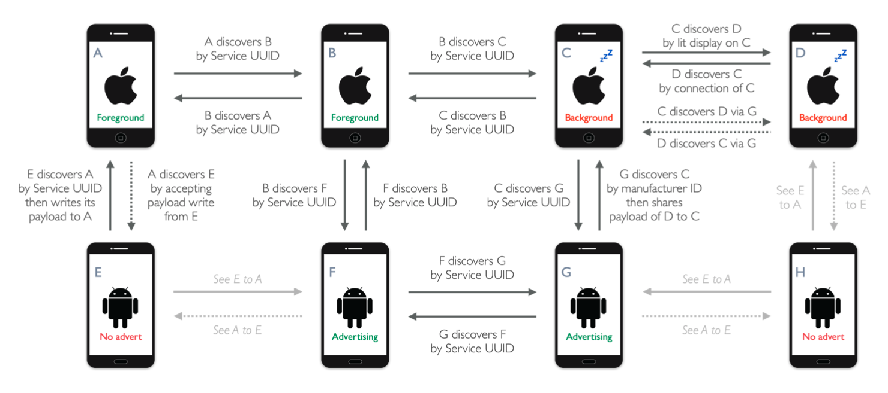

# Design summary

The complexity of achieving reliable BLE communication and regular distance sampling across iOS and Android devices stem from the fact that both platforms have different behaviours and limitations, and there are additional challenges when the app is running in the background, which is expected to be the norm. Furthermore, many Android devices do not support BLE advertising. Figure 5 presents a summary of how device discovery is achieved in Herald between all combinations of platform, app state, and BLE advertising support.

## Quality Assurance

Herald was developed as an entirely new product, based on lessons learnt from previous work and knowledge from open source projects. All the code is new, and it does not rely on any external libraries, beyond the standard iOS and Android platform libraries, thus a review of Herald code will cover all its functionalities, avoiding the need for additional work to review supporting libraries. This development principle ensures Herald is not subjected to any existing licensing constraints, and therefore can be adopted and used for free without restriction. All the code is available in the public domain for inspection and independent evaluation, along with test tools, documentation, and detailed test results. Transparency is essential for gaining trust, Herald offers total transparency.

The Data and Protocol sections have shown the complexity involved in achieving reliable BLE communication and regular distance sampling in backgrounded iOS and Android apps. Herald was developed iteratively, by systematically identifying and resolving each challenge, while balancing the impact across both platforms at the same time. This was made possible by adopting a robust test driven development (TDD) methodology, where a prototype can be automatically, objectively, thoroughly, and quickly evaluated according to a complete set of measurable epidemiology requirements, thus confirming each layer of mitigation against a new challenge has no negative impact on previous solutions. In other words, Herald development was guided and assured continuously by a fixed set of comprehensive regression tests, to
prioritise development effort according to impact on epidemiology requirements, as well as collecting evidence for quality assurance of incremental changes. All the intermediate test results are available for review and inspection.

A key feature of the Herald development process is that the work was performed by a small team of cross-platform developers who can all work on both iOS and Android version of Herald at the same time to establish trade-offs across the platforms for every element of the solution. This is unusual as most developers tend to work on one of the platforms independently, rather than both at the same time. For Herald, cross-platform development was essential as every change on one platform tend to impact the other platform, thus a deep understanding of both platforms, and working on both versions of the code simultaneously was the only practical approach in finding compromises that offer the best performance across both platforms.

Finally, following an analysis of epidemiological requirements, in particular the recognition that population reach is fundamental for disease control, the Herald development team made a conscious decision to conduct all development work and testing on the most challenging combination of devices throughout development. The aim is to ensure the solution is compatible and performant across the widest range of smartphones to maximise population reach, and all failure conditions are identified for resolution during development. In essence, the team was constantly attacking the solution to create repeatable failure conditions for investigation and resolution.

This is an unusual approach as many development teams tend to use new and reliable equipment for development, and work backwards towards older and more challenging devices over time, however it was essential for Herald to support older, limited, and unreliable devices as every percentage drop in compatibility and reliability has a significant and measurable impact on coverage in contact tracing, and the efficacy of the intervention.

All information about Herald, including design, code, documentation, and test results are in the public domain (Herald Project, 2020) for review, inspection, and independent evaluation. The project team welcomes request for support in conducting independent testing of the solution, and also adoption of the protocol for experimental and production use.

## Conclusion

This document presents the detailed design of Herald, covering both the iOS and Android version of the cross-platform protocol. The aim is to provide a comprehensive description of the protocol to support design and security reviews. Additional information can be found on this website, including links to the full source code, demonstration apps, integration guide, background research, lessons learnt, payload specification, test procedure, evaluation metrics, test tools, and test results for review and inspection.

## References

Please see the [Bibliography]({{"/efficacy/bibliography" | relative_url }}) for references.

Next: [Herald Payloads Guide]({{"/payload" | relative_url }})
