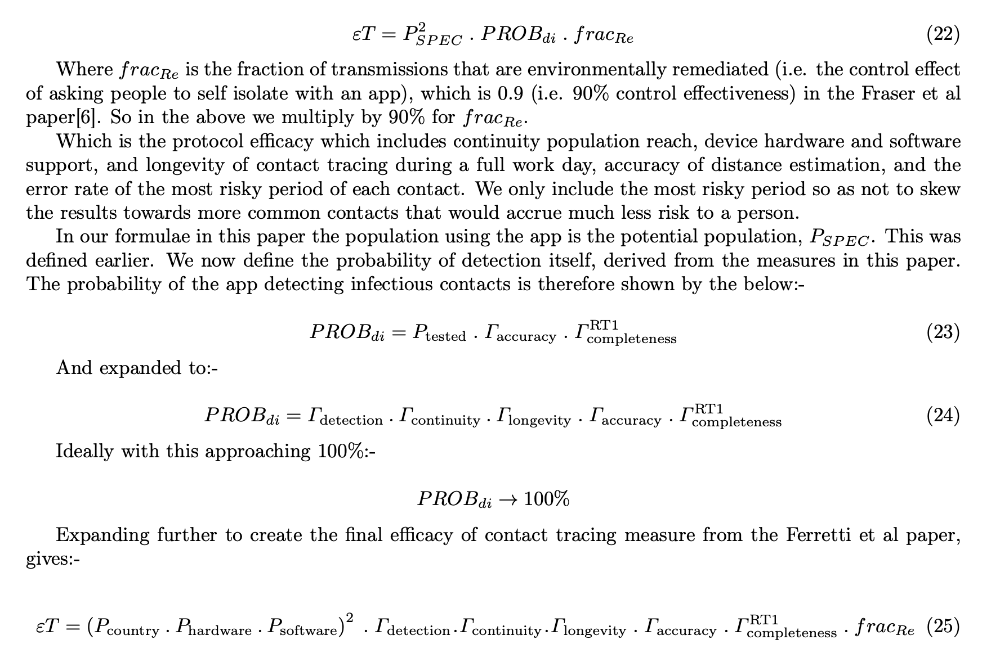

---
# Feel free to add content and custom Front Matter to this file.
# To modify the layout, see https://jekyllrb.com/docs/themes/#overriding-theme-defaults

layout: docs
title: The Fair Efficacy Formula paper
description: Our fair efficacy formula for comparing proximity detection protocols
menubar: research_menu
---

# The Fair Efficacy Formula paper

We took the efficacy measure mentioned in the Ferretti et al paper and reasoned
the constituent parts that affect the probability of detection of 30 second
segments of any contact event.

## Where can I get the paper?

The paper is now available on medRxiv here: [https://www.medrxiv.org/content/10.1101/2020.11.07.20227447v1](https://www.medrxiv.org/content/10.1101/2020.11.07.20227447v1)

## The Fair Efficacy Formula

The resultant formula is below:-

Where:-

- ET is the 'Efficacy of Contact Tracing' as described in the Ferretti et al paper in March 2020 from the Oxford Big Data Institute
- 'Probability of detection' as per the Ferretti et al paper, in mobile app terms rather than manual tracing terms, is the probability of detecting a person's risk of exposure to COVID-19 and the efficacy of detecting, measuring, and basing health advice (such as please self isolate for 10-14 days) on this collected data, and crucially doing so the same day of knowing they were exposed by a positive case (in under 4 hours)
- Pspec - Population reach. In our paper we talk about maximum population reach as those who could download and make use of the app - i.e. the maximum population reach
  - Pspec-squared - As you need two phones to communicate in both directions to measure mutual exposure risk, you must square the Pspec value (as it applies to both phones in a contact)
  - Pcountry - Proportion of people in a given country/area of interest that have a mobile phone (taken as smartphone, rather than tablets of course)
  - Phardware - Those with hardware that supports the given protocol. Bluetooth Low Energy for the Herald Protocol. Other protocols have restrictions here. E.g. ~35% of Android phones do not support 'Bluetooth advertising' which means they cannot be detected by other phones. This is true of many other (non-Herald) bluetooth protocols for contact tracing
  - Psoftware - Any software restrictions artificially made by the protocols design. E.g. some common protocols only support the latest phone operating systems, or use cryptographic libraries that are not available on all phones. This limits their reach, especially in poorer parts of the world or even in the UK in certain poorer areas
- Rdetection - Rate of basic detection (one-way) of phones during any given scenario. This is separate from Rcontinuity as in practical tests a non detected phone would not appear in the totality of phones in Rcontinuity, and so we include it separately.
- Rcontinuity - The percentage of 30 second windows a distance estimation (RSSI reading for Bluetooth) ocurred (one-way). Choice of 30 seconds is described below.
- Rlongevity - A protocol that gets worse over time must have this reflected. This is how the rate of detection varies between the first hour of an at least 8 hour test and the last hour. This will ensure people are protected for an entire normal working day without intervening to their phone's contact tracing app
- Raccuracy - How accurate the distance analogue (E.g. RSSI) reading is at a short period of time at a known distance compared to how its analogue reading is over a long time. A measure of estimator accuracy especially relevant to when short periods of close distance (highest risk) occur. Does NOT include error rate of converting analogue to distance and performing a risk calculation - this is the same for all formulae, and so is left to other papers to define in Risk Accuracy (See the Turing paper on risk measurement)
- Rcompleteness RT1 - How well a recorded set of data around the riskiest (nearest) point of a contact event fits actual exposure. Think of this logically (not numerically) as the first standard deviation around the mean risk exposure. Under the Oxford model the vast majority of risk is accrued at the nearest point of distance, and so this measure is used here. 
- fracRE - This is a fixed (0.9) value as per the Ferretti et al paper. It is not 1.0 as to ensure the final efficacy rating does not appear 'perfect', as there are always unknown problems with measuring and communicating transmission. We recommend more work is done to define this value, and determine if it changes in certain situations in the real world.

## Why is it needed?

There was no standardised way to measure proximity detection and continuity of
coverage of a contact event other than simple "Percentage of devices detected
during an entire test" style high level metrics.

Whilst useful, those simplistic metrics miss out a variety of low level Operating System, 
Hardware, and especially protocol behaviours that can lead to a misrepresentation or
misunderstanding of efficacy in epidemiological terms.

In short the simple measure tracks 'detection of phones' and not 'detection of risk exposure'.
The fair efficacy formula presented in our paper (under peer review) does this.

Epidemiologists need to calculate exposure risk based on time and distance of any contact
event. The closer people are together, the higher risk. The length of the 'exposure window'
will determine how fine grained such risk scores are. Performance across a range
of devices prevalent in a particular population will determine a protocol's maximum reach.

All of these measures need to be understood in order to truly score and compare the
effectiveness of any Proximity Detection Protocol and therefore the contact tracing 
applications and health service responses built on this underpinning.

## Why is it fair?

We took a step back and considered what physically happens between two mobile devices
during a contact event. We then reasoned what actions could occur to reduce the chances
of a part (window) of a contact event from being correctly recorded. 

We then created dummy data for a simple theoretical contact event. We then applied
an existing risk scoring model to show how a 'perfect protocol' and a protocol that
exhibits some deliberate limitation could modify the observed risk.

This then led us to create a formula that took in to account all limiting factors
that a user of such a contact tracing app could encounter in a particular day.

We then applied this formula to a brand new Bluetooth protocol called [Herald]({{"/protocol" | relative_url }}).
We were able to identify and rapidly tune this protocol in 5 weeks thanks to the presence
of the fair efficacy formula, and approaching the problem in an epidemiologially data driven
way.

## Didn't you build this for your own protocol? Aren't you biased?

No. Although it is true that some of the authors of our paper and protocol worked on
previous COVID-19 app efforts for governments, we built this measure independent of any 
particular protocol and before we wrote our
new protocol from scratch. We wanted to be sure we could encourage all teams to
use our measure to communicate their own protocols' effectiveness with their
country's population. The hope is to increase the use of, and trust in, contact tracing
applications worldwide - no matter whose protocol they use.

Once we completed the design of the formula we created a new protocol based on our 
new knowledge of
what affects efficacy, and used the formula to test and measure its performance,
and directed our efforts at the mechanisms that would provide most epidemiological
advantage. 

Our [protocol]({{"/protocol" | relative_url }}) has therefore a high score on the measure,
but that's because we've been using the formula and testing approach for longer.
The formula wasn't designed to show our protocol in a good light. We would
encourage all teams to apply our formula to their work and rapidly iterate to improve 
their own efficacy. This way more lives can be saved.

## What doesn't it cover?

The paper does mention some items out of scope of our research that others are 
already working on, or where published material already exists. This includes:-

- Converting distance analogue (E.g. RSSI in Bluetooth) to distance (Although we do mention some observations we have on [distance calibration]({{"/bluetooth/distance" | relative_url }}))
- Anything outside of the mobile phone - We only deal with phone to phone communication in our measure - we do not deal with isolation efficacy or speed to isolation metrics
- Any technology-specific variations - The measure is independent of any technology, although we often explain it in terms of Bluetooth because this is the predominant technology available today
- Manipulation of multiple readings - We leave these discussions to those designing end to end
contact tracing systems. Mechanisms include local triangulation to get a more accurate distance estimation, or performing multiple readings in quick succession to provide more accuracy
- Payload specifics - We use a 129 byte payload in our tests of our own protocol, but our measure does not mention this specifically. The affect of any such length of transmission on efficacy will be caught in the detection and continuity measures and so there was no need to consider payload specifics, only measure how often a particular protocol takes estimation readings for another device

## Data from the paper

The synthetic data and calculations used in the paper can be found in the [Synthetic Data Spreadsheet (ODS)]({{"/documents/protocols-paper-synthetic-data.ods" | relative_url }})

## Follow on work

From the paper: "Now a low-level protocol that works across a large range of devices exists in the Herald protocol, the author aims to suggest a payload to transfer over this protocol that allows for its use in either a centralised or decentralised contact tracing application. This will provide international interoperability whilst allowing local jurisdictions to tailor their approach to one acceptable by its residents."

We also believe that more work needs to be done to ensure that any [RSSI to distance estimation formulae]({{"/bluetooth/distance" | relative_url }}) takes account of the fact that some phone pairings appear to use a log-distance approach to scale their RSSI values, whereas others use an inverse-distance-squared approach. This leads to inaccuracies around the 2.5m mark.

## Update: Oxford Simulations OpenABM-COVID-19

Since the first draft of the paper was distributed, Oxford University's Big Data Institute (BDI) 
have released OpenABM-COVID-19[27]({{"/efficacy/bibliography#a-27" | relative_url }}), a Jupyter notebook simulation of COVID-19 cases, spread, and hospitalisation
statistics given a population size, existing number of cases, and settings for various control methods.

The paper we have written has a new section in it detailing how to take the output
of the fair efficacy formula and apply it to an OpenABM simulation for COVID-19 spread.

Our team has created an extension to Oxford's work to simulate the disease spread curve given
efficacy results presented in the Fair Efficacy Formula. This is currently undergoing review.
Once verified, the results and spread control charts shall be published here.