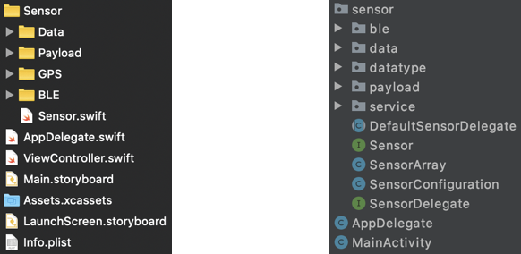

# About the code

This section describes the whole code base.

## Test applications

Herald is delivered as a fully functional test app on iOS and Android. The recommended first step 
is to clone the iOS and Android GitHub repositories in Xcode and Android Studio, then deploy and 
test the apps on your own devices to ensure your development environment is compatible and to gain 
confidence in Herald. Full details of our development environment and procedure for deploying and 
testing these test apps are available on the GitHub repositories.

GitHub repositories:-
- [iOS API and App](https://github.com/vmware/herald-for-ios)
- [Android API and App](https://github.com/vmware/herald-for-android)
- [C++ API and Apps](https://github.com/vmware/herald-for-cpp)

## Understanding the code

The iOS and Android test app code have similar packages and structure for ease of understanding and integration. All the code required for integration into your contact tracing app  can be found in the sensor package. Files and resources outside of this package are only used by the test app, and not required for integration.

The starting point for integration is the Sensor protocol/interface and the class ```SensorArray``` that implements this protocol/interface. A typical app will negotiate device registration data with a server (e.g. unique identifier and shared secret), then instantiate its device identification payload data generator (e.g. for encrypting the unique identifier for sharing with other devices over BLE). Herald can then be used as the transport for this encrypted data by instantiating a ```SensorArray``` with the instantiated data generator as a ```PayloadDataSupplier``` (see Payload package) and registering a ```SensorDelegate``` (see sensor package on Android or ```Sensor.swift``` on iOS) to receive proximity detection data for recording and processing on-device or centrally.



For reference, the purpose of the other packages are as follows. For iOS, the Data package 
contains a range of loggers for on-device logging of application and detection data for debugging 
and testing. Most of these loggers are optional in a production environment and can be disabled 
by modifying the SensorArray initialisation code. 

The Payload package contains the interface ```PayloadDataSupplier``` for integration with your own 
device identifier data generator. This interface is called on every read payload request 
from another device, thus offering the opportunity to mutate your payload to maintain 
security and privacy. 

For variable length payloads, you will also need to implement the data parser method for 
partitioning a concatenation of payloads into individual payloads. This is necessary as 
the payload sharing code transmits multiple payloads in a single transmission to 
enable efficient detection across iOS and Android devices. 

The GPS package provides the optional location monitoring capability. 
The default implementation uses the location monitoring capability, 
not to monitor user location, but to enable beacon ranging which is 
necessary for iOS background operation. Finally, the BLE package contains the 
Bluetooth LE based proximity sensor that makes up the core of Herald. 

All the configuration data for BLE operation can be found in the struct ```BLESensorConfiguration```, 
for instance the service, characteristic and manufacturer UUID for the beacon service, 
and also the advert refresh interval.

For Android, the BLE, Data and Payload packages are identical to iOS. The Datatype package 
contains classes for implementing the type aliases in iOS, as aliases are not supported in 
Java. The Service package contain the foreground and notification services that are 
mandatory for continuous background operation on Android.

You now need to [Import the Herald library]({{"/guide/add" | relative_url }}) to you app.
