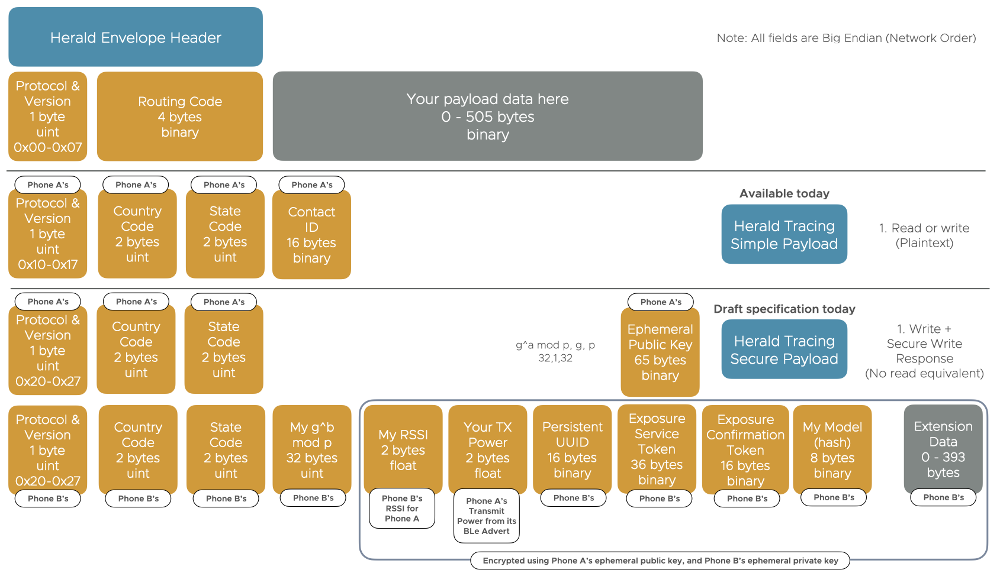

---
# Feel free to add content and custom Front Matter to this file.
# To modify the layout, see https://jekyllrb.com/docs/themes/#overriding-theme-defaults

layout: page
title: Developer and Integration Guide
description: Full development guide for the iOS and Android Herald protocol and provided sample payloads
menubar: docs_menu
---

# Design & Integration Guides

This section describes how to integrate Herald in to your own applications.

Below is a set of options for using the [Herald Protocol](../protocol) in both a Contact Tracing application, or a custom
commercial application.

With Herald you can use our suggested full or header [payloads](../payload), or an entirely custom payload:-

## Herald protocol integration

Please see the [Herald protocol integration guid (PDF)](../documents/IntegrationGuide.pdf) file for integrating
the Herald protocol in to your nation's contact tracing application.

## Detailed design information

Please see the [Herald design document (pdf)](../documents/ProximityDetectionSolutionDesign.pdf) file
for detailed implementation design details about how the Herald protocol works.

## Herald protocol formal specification

COMING SOON! This document is currently being written.

## Herald Simple and Secured payload formal specification

COMING SOON! This document is currently being written.

## Something missing?

Please do [log an Issue on GitHub](https://github.com/vmware/herald/issues) for any missing documentation
or to ask us to correct errors or provide clarification. We want to provide very high quality integration
documentation to help development teams integrate the Herald API.