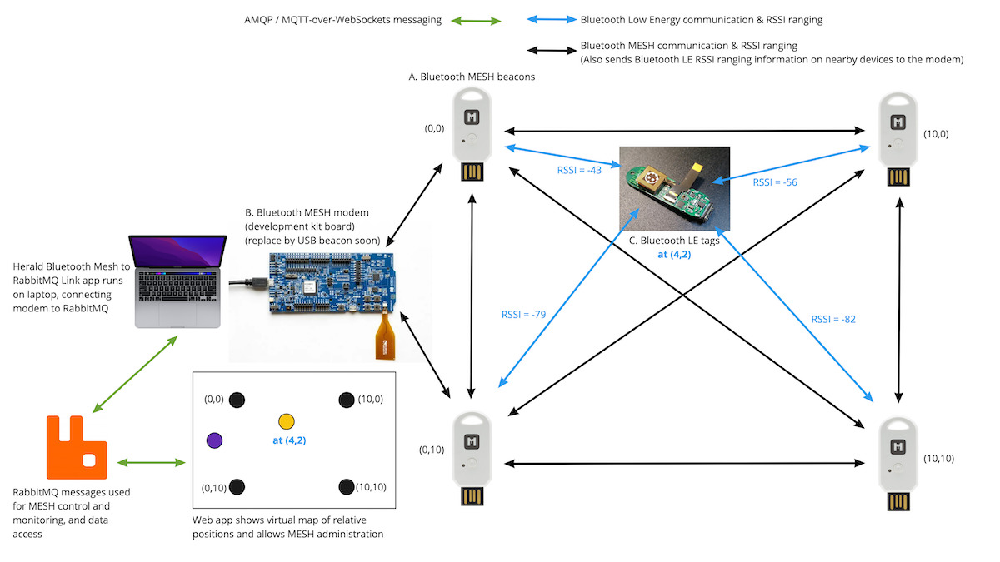

# Herald Bluetooth MESH Networking

A Smart Hospitals or other Smart Building network can be created and
managed from a single or multiple machine with Herald's various 
Bluetooth MESH applications and API.

Herald provides a Bluetooth MESH API built exclusively for 
[Zephyr RTOS](https://zephyrproject.org/)
and provides pre-built open source embedded device applications,
embedded hardware and wearable designs, and administration
microservice implementations.

A typical Herald Bluetooth MESH demonstration network is shown
in the below diagram:-

This diagram shows several device types. Below are their descriptions and
the Bluetooth MESH roles they support in our Herald MESH applications:-

- A. Herald MESH Relay application
  - A constantly powered small Bluetooth MESH and LE Beacon
  - Acts as a Bluetooth MESH Relay and Friend standard roles
  - Acts as a Presence Server and Location Beacon in Herald vendor roles
  - Provides a Herald Bluetooth Low Energy Venue Beacon to nearby Bluetooth Low-Energy only devices
- B. Herald MESH Modem application
  - A constantly powered MESH node that bridges Bluetooth and Computer Server networks
  - Acts as a Bluetooth MESH Provisioner (Adv only)
  - Provides a USB CMC ACM (tty) modem-like protobuf protocol for controlling the MESH
  - Acts as a Presence Subscriber, Presence Client, and Location Beacon Client
- C. Herald MESH or LE Tags
  - A battery powered MESH or LE node that transmits an ID that is seen by the Herald MESH Relays
  - If implemented using Bluetooth MESH, acts as a Low Powered Node with a Location Beacon Server
  - If implemented using Bluetooth LE, acts as a Herald Venue Beacon
- D. (Not shown) Herald powered consumer Mobile Device
  - A mobile phone searching for Herald Location Services (Location/Venue Beacons)
  - May be also providing a Digital Contact Tracing Bluetooth LE GATT Service (Herald LE Payload / OpenTrace V2)
  - Not enrolled into the MESH and can only read Bluetooth LE services on the Herald MESH Relay nodes
  - Will be used to provide 'navigate around this facility' functionality (uses Herald Venue Beacons)
  - May be used in future to provide 'outpatient sign in' functionality (using a future secure sign in mechanism)

## Current hardware implementations

The Herald Project provides
[Open source hardware designs](https://github.com/theheraldproject/herald-hardware/)
for Bluetooth Low Energy and MESH wearables and beacons. The current demonstration network as shown
above, however, uses off the shelf hardware from Maker Diary, namely the
[nRF52840 MDK USB Dongle](https://makerdiary.com/products/nrf52840-mdk-usb-dongle-w-case).

This is a very capable device with support for Bluetooth Low Energy, MESH, NFC and USB which the
Herald project uses. They are also capable of Thread, Matter and Zigbee communications.

These devices use lower performance chip antennae and so are really only aimed at demonstration
installations. They are cheap and easy to use as a starting place though.

The devices are based on the Nordic Semiconductor nRF52840 System on Chip (SoC) and the UF2
bootloader which can be mounted as a Flash drive for programming. They have only 1MB Flash
storage and 256 KB RAM, but this is more than enough for any complex MESH relay application.

This chip also incorporates the Arm TrustZone CryptoCell 310 device. This provides security
functionality but does not provide a secure store. This makes the devices useful for testing,
but not suitable for a production Bluetooth MESH installation that needs to conform to
industry Internet of Things (IoT) security standards such as
[PSA Level 1 Certification](https://www.psacertified.org/what-is-psa-certified/using-psa-certified/).

## Herald MESH wearables / beacon implementation

In 2020 The Herald Project worked with advice from the United Nations Development Programme (UNDP)
to design a low-cost wearable that could be manufactured in most device fabricating factories
through the world. The idea here was to provide a Bluetooth Digital Contact Tracing capable
wearable for countries where the latest handsets and 4G coverage was not possible.

This culminated in the creation of the 
[Herald Wearable and Beacon V1 opensource hardware](/apps/wearable)
. This can be manufactured into a basic Digital Contact Tracing wearable for around USD 25 - USD 35.
A daughter board has also been designed for the wearable that provides Blood Oxygenation and
heart rate information for an additional USD 15.

This is based on the Fanstel BC833M pre-certified chip which uses the Nordic Semiconductor
nRF52833 SoC. This chip is designed for low power use and has more memory than the original
nRF52832 SoC. It has 512 KB Flash and 128 KB RAM. This is enough for Herald Wearable and
Bluetooth Low Energy beacon devices, but not for MESH Relay nodes currently. 

Our hardware
design incorporates an external additional Flash storage area, USB-C connector,
accelerometer, and multi frequency daylight sensor. This is to facilitate more sophisticated
on-device, privacy preserving, data and exposure risk analytics than is possible with
mobile phones. They can be paired with mobile phones, or interact with a Bluetooth LE
Herald network such as provided by Herald MESH Relay nodes.

## Future Herald MESH Relay open source hardware design

This future design will use another pre-qualified Fanstel module but this time based
on the nRF5340 SoC. This SOC provides an Arm TrustZone CryptoCell 312 implementation
that does provide a secure enclave. This will allow this device to pass the
[PSA Level 1 Certification]()
mentioned above.

It should be noted that both the SoC and the Zephyr RTOS we use already have
PSA Level 1 certification. Below are links to the relevant certification pages:-

- [Nordic nRF5340 PSA Level 1 Certification Page](https://www.psacertified.org/products/nrf5340/)
- [Zephyr RTOS PSA Level 1 Certification Page](https://www.psacertified.org/products/zephyr-project/)

The Herald Project aims to get PSA Level 1 Certification for the following items eventually:-

- Herald Beacon V2 opensource hardware
- Herald MESH Relay Application (Beta in May 2022) - GitHub code link coming soon
- Herald MESH Modem Application (Beta in May 2022) - GitHub code link coming soon

## Find out more

You can now view the [Herald MESH Models](/mesh/models) page to find out how this is implemented.