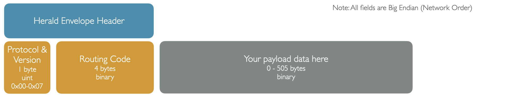

# Herald Envelope Header

Each national contact tracing team has two competing aims when it comes to payload:-

- Provide the unique information necessary / permissable under their law to enable contact tracing
- Ensure where possible their payload allows for international interoperability

In the Herald Envelope payload for Contact Tracing we provide the outer payload to allow for international
interoperability but leave the inner payload - the data payload for that country - to the national team
to implement.

We recommend each country use the Envelope protocol and embed their payload as an [Inner Payload]({{"/payload/inner" | relative_url }}),
but there's nothing stopping individual groups from creating their own [Outer payload]({{"/payload/outer" | relative_url }}) if they wish.
Doing so though will prevent international interoperability between contact tracing apps and devices.

## What does the outer payload provide?

The outer payloads allow for certain standard data to be passed.

Note: All numbers are Big Endian (network order).

- Read ID payload
  - Payload identifier and version - 4 byte unsigned integer - 0x00 for Herald envelope payload V1.0, up to 0x07, wrapping around for further versions (not part of the signature)
  - Inner payload data - See the [common contact tracing header]({{"/payload/common" | relative_url }}) for options for this content for contact tracing, or custom use cases
- Calling card / ID write payload
  - Same content as for Read ID payload
- Calling card / nearby devices read payload - most recent devices only
  - Multiple payloads, consisting of:-
    - Payload type - 1 byte integer. 0 = direct read, 1 = direct write, other values reserved for future use
    - Received time - 4 byte signed integer, unix epoch seconds when the echange was observed by the device
    - Payload data - as per individual read/write payloads, above. You MUST either configure a fixed length value in the Herald outer payload, or provide your own custom parser to split each shared device payload.
- Calling card / nearby devices write payload (disabled by default in the Herald protocol)
  - Exactly the same as for calling card read payload - most recent devices only

## Reserved fields

Any protocol and version identify ending in 0-7 (E.g. 0x00-0x07, 0x10-0x17, 0x20-0x27) is reserved
for the use of the Herald Project. You are free to use any other values.

You do not need to register your protocol IDs with us so long as you use a different Bluetooth
service UUID and characteristic UUID. If you wish to provide an extension to Herald, as we
have done for our [beacon]({{"/payload/beacon" | relative_url }}) payload, then please do let us know what
range you are using.

## International Interoperability

The envelope header is the cornerstone of international interoperability. Please see the [Interoperability page]({{"/payload/interop" | relative_url }}) for full details
