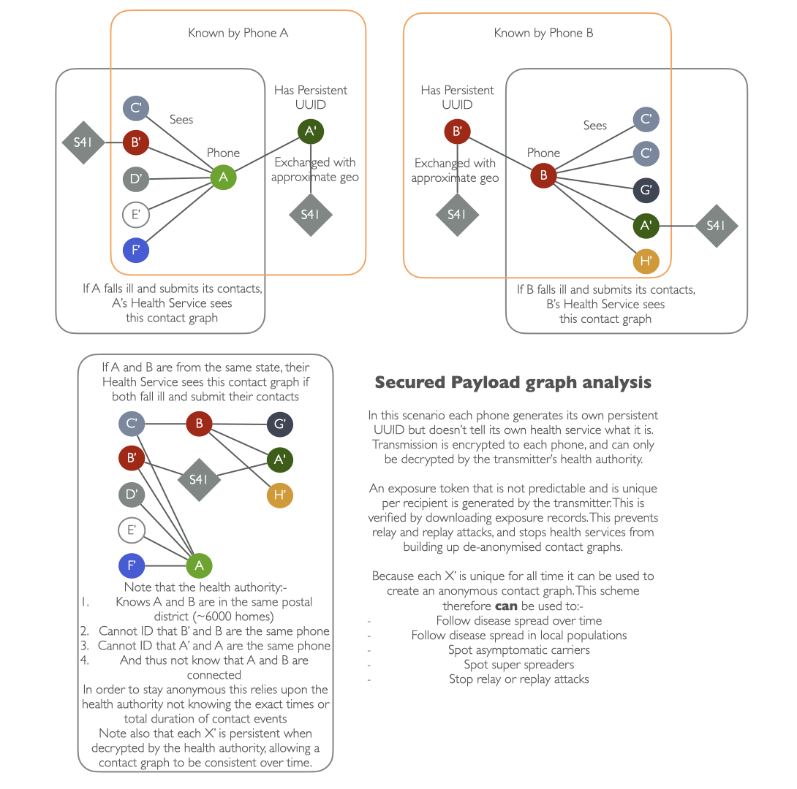

---
# Feel free to add content and custom Front Matter to this file.
# To modify the layout, see https://jekyllrb.com/docs/themes/#overriding-theme-defaults

layout: docs
title: Herald secured inner payload
description: Simple secured payload for contact tracing
menubar: docs_menu
---

# DRAFT Contact Tracing Secure inner Payload

This example of an [inner payload]({{"/payload/inner" | relative_url }}) that is designed to work exclusively with
the [Herald envelope payload]({{"/payload/envelope" | relative_url }}) provides additional security and privacy
guarantees over and above the [Herald simple inner payload]({{"/payload/simple" | relative_url }}) example.

Click here to [View the Formal Specification for the Secured Payload]({{"/specs/payload-secured" | relative_url }})

This payload was driven by two somewhat competing desires:-

- Provide as much information to a state/national health authority as possible to prevent virus transmission
- Preserve contact-to-contact privacy

The data we support for both is described in the following two sections. Later follows a detailed explanation
of how the payload works.

<b>DRAFT</b> This is a draft payload description currently under review.

## Providing information to a national health authority

We wanted to support these extended contact tracing approaches:-

- Allow the tracking of spread throughout a contact graph network, with persistent graph-node identifiers
- Allow the spotting of asymptomatic individuals, and super spreaders, through network analysis
- Support not just First Order contact notifications, but also Second and Third order, to drastically cut virus transmission in the peak of a pandemic

This places some restrictions on the outer payload:-
- ClientID is knowable by the health authority and can be linked to a persistent identifier over time (although NOT necessarily the registration ID of that phone user)

This also requires the inner payload to provide the following information:-
- Exposure service token (32 bytes) - Token issued by phone A allowing the remote phone B to notify phone A's health authority that the exposure is valid
- Phone exposure confirmation token (16 bytes) - Token issued by phone A, passed by phone A's health authority back to it when phone B is ill, allowing that phone to verify that the exposure is real, and was not the result of a replay/relay or spoofing attack, or the result of health authority for phone A being compromised

## Enhancing privacy

Privacy is an issue when an organisation can request, warrant, or extract the contact information from a health authority and identify the individual phones or users
behind the ClientIDs passed during contact event sharing. I.e. knowing the identity between the 'nodes' on a contact graph.

Ideally we want to share a solid and verifiable contact graph with a national health authority without them knowing both sides of the contact graph, even if both sides declare themselves as ill
and submites their contact information to the same health authority.

The way to do this is to provide edge information to the health authority, and a persistent but unregistered identifier (Node ID) for the contacts. The way to ensure that the exposure
is a valid one and only acted upon is to verify the tokens shared between the two phones locally, and encrypted so only they know the content shared,
and verifiable with secrets only stored in the secre enclave of each phone.

Basically we do this:-
- Provide all graph edge information to the health authority, and risk calculation is done centrally, subtotalling by Persistent UUID
- Post the ClientIDs, exposure confirmation tokens, and summarised risk subtotals to all devices under the health authority's control - regularly, within 30 minutes of receipt (See the Ferretti et al paper, March 2020 for rationale)
- Leave exposure risk verification, and notifying to the health authority that the user is exposed, to the exposed mobile phone (not doing this centrally)

Identity information is managed as follows:-

- Each phone registers with a heath authority on first launch, and creates a base symmetric key using Diffie-Hellman-Merkle approach, and agrees an epoch time
- Each phone uses the symmetric key and agreed epoch to generate a ClientID using the TOTP approach [RFC-6238 (external link)](https://tools.ietf.org/html/rfc6238). This is NOT the outer packet client id, but a validation ID used to secure comms to the health authority (E.g. via a one time use security header)
- Each phone generates two of its own public/private key pair which is stored only locally in the secure enclave. These are:-
  - Ephemeral public/private key pair, for short lived cryptographic comms between devices over Bluetooth. MUST be generated per-device and used only once (I.e. for this single client exchange). Never shared with the health authority, deleted after use.
  - Exposure confirmation public/private key pair, used to generate locally verifiable exposure confirmation tokens. Regularly rotated (E.g. daily), but stored locally for 15 days for verification. Never shared with the health authority
- Each phone generates a 256 bit (32 bytes) symmetric key, stored locally in the secure enclave, along with a random epoch value less than the ClientID epoch value, and generates the ClientID using TOTP. Key never shared directly with the health authority, but the TOTP result is.
- Each phone generates a 16 byte UUID used as a persistent identifier. Never shared by the transmitter directly with a health authority, only indirectly via a nearby phone, and only encrypted using the health authority's submission TOTP data

## Who knows what, and when?

Below is a visual representation of what each phone and health authority knows:-

NOTE: Please see the [Interoperability page]({{"/payload/interop" | relative_url }}) on how the secured payload ensures security and privacy whilst working between multiple countries.

## Security Analysis Summary - CIA

Confidentiality - Yes. Provided by encrypting all data between both phones, and from phones to health service, preventing interception, spoofing, relay and replay attacks. A one time use Diffie-Hellman-Merkle symmetric key agreement is used to encrypt the data. Uses phones' built in secure enclave for storage of cryptographic material where provided.

Integrity - Yes. By using a TOTP code that the health authority can decrypt and an exposure confirmation token the transmitting phone can only decrypt, the transmitting
phone knows that both phones and its health authority have all been involved in the exchange, and the data has been verified. Data cannot leak or be extracted and
use by another device as the transmitting device checks the time and tokens it issued, ensuring integrity. Even if data passes via a health authority of a hostile
state actor it cannot be manipulated to cause the exposure of incorrect or targetted individuals and groups of the originating country.

Availability - Yes. Bluetooth provides built in CRC checks of data, so by the time Herald sees the data it has already been validated. Supporting both read
and write approaches to Bluetooth data exchange ensures the maximum support of mobile phones, as some phones can discover and read and write from others,
but not be discoverable and readable/writable themselves (~35% of Android phones in the UK do not support advertising [[21]](../paper/bibliography#a-21)).

Non-repudiation - Yes. The original transmitter can verify that the exposure token was from the exact phone they communicated with and that their
data was decrypted and interpreted by their own health authority, and that the time of the contact is valid. All three participants (Transmitter, Receiver, Transmitter's health authority)
are authenticated in this approach. Authentication of the receivers health authority if left to the communication channel between those authorities.

## Formal specification

Please see the [Formal secured payload specification page]({{"/specs/payload-secured" | relative_url }}) for full details
