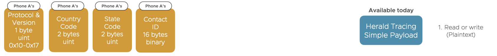

---
# Feel free to add content and custom Front Matter to this file.
# To modify the layout, see https://jekyllrb.com/docs/themes/#overriding-theme-defaults

layout: docs
title: Herald simple inner payload
description: Simple inner payload for contact tracing
menubar: reference_menu
---

# Contact Tracing Simple inner payload

This inner payload allows for minimum information sharing - just large enough to enable contact tracing.
This makes it simple, but it's not as secure as the [Herald Secured payload]({{"/payload/secured" | relative_url }}), and
really only supports decentralised contact tracing.

Click here to [View the Formal Specification for the Simple Payload]({{"/specs/payload-simple" | relative_url }})

In particular the simple payload:-

- Doesn't provide a consistent ID for the device the packet is exchanged with (not a problem for decentralised exposure)
- Doesn't provide remote phone make and model, limiting local distance estimation and thus risk scoring
- Doesn't provide verification of the outer packet's validity itself (i.e. doesn't allow a national authority to additional verify the outer packet signature)
- Does prevent replay and relay attacks
- Does allow verification of the remote contact having come from the right phone, if local history is persisted of contact events
- Does not prevent a brute force attack whereby random Contact IDs are generated and submitted by a compromised device
- Does not prevent the creation of an 'ill person tracker' as the Contact ID is sent in the clear between devices, and is the same for all devices it talks to at the same time

## Simple inner payload content

In addition to the information in the [Herald envelope header]({{"/payload/envelope" | relative_url }}), the simple
inner paylod provides the following data.

Note: All numeric data is big endian.

- Verification token (16 bytes) - The ClientID (16 bytes) of the other phone, encrypted using this phones local, 
ephemeral, private key (32 bytes) for the time period the outer envelope packet was generated in (allowing for local matching
and verification)

## Who knows what, and when?

Below is a visual representation of what each phone and health authority knows:-

## Security analysis summary - CIA

Below is a simple security summary.

Confidentiality - No. The Contact ID can be intercepted in the clear by any Bluetooth 
device, allowing relay and replay attacks. Only the phone who generated the Contact ID
will know who it belongs to. By rotating the Contact ID regularly (E.g. every 15 minutes)
localised Bluetooth tracking can be reduced (E.g. adboard)

Integrity - Yes. Only the sequence of codes for a particular phone can be known
by that phone for that time point as only that phone has the daily key seeds. 
Data could not be manipulated or predicted such
that an individual phone could be targeted.

Availability - Maybe. Could be compromised by a brute for attack DDoS-ing the healthcare 
system using a fake network of pre-registered devices. Amplification attacks are 
possible in this approach. This can be somewhat mitigated by using a max number 
of notified contacts per ill person submission approach, but this doesn't prevent 
the creation of a fake network with, say, 5 notifications each.

Non-repudiation - No. Neither the health authority nor receiving device are authenticated
in this approach. The healthcare system and the transmitting phone also cannot verify
that the person presenting the Contact ID is the one for whom it was initially transmitted
to.

## Formal Specification

Please see the [Formal simple payload specification page]({{"/specs/payload-simple" | relative_url }}) for full details