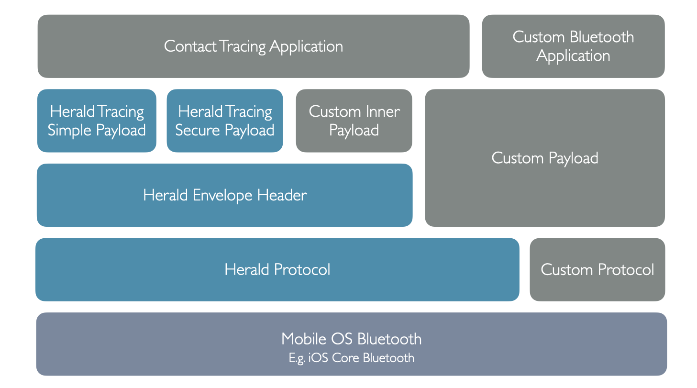

---
# Feel free to add content and custom Front Matter to this file.
# To modify the layout, see https://jekyllrb.com/docs/themes/#overriding-theme-defaults

layout: docs
title: Herald protocol design
description: Our privacy preserving and secure protocol for slowing disease spread
menubar: docs_menu
---

# The Herald Protocol

There are many parts to communication amongst contact tracing apps. This can be thought of as layers, starting with the foundation and building up:-

- Mobile Operating System (OS) provided communication layer (E.g. Core Bluetooth on iOS)
- Low-level reliable information exchange and distance estimation protocol - aka a Bluetooth Proximity protocol - such as the Herald Protocol described here
- The application payload - Such as information to allow contact tracing exposure tokens to be shared between devices. See [payload]({{"/payload" | relative_url }}) for details on payload options
- The mobile application - That provides payload information, performance settings to the protocol layer

Our Herald payloads take on a variety of privacy and security issues whilst allowing epidemiologists and medical authorities appropriate levels of information to allow them to react to an epidemic and control it using mobile phones.

Note that the Protocol is described here, but the Payload that we are recommending for COVID-19 control is specified in the [Payload]({{"/payload" | relative_url }}) section. The Bluetooth Protocol we describes is generally useful for any application that requires high fidelity, high density, small packet size, low frequency data exchange between mobile phones.

## Highlights

- Supports 98% of UK phones in use. (98% of UK people have a smartphone with Bluetooth Low Energy support.) Source: OFCOM reports [[9]]({{"/efficacy/bibliography#a-9" | relative_url }}) [[10]]({{"/efficacy/bibliography#a-10" | relative_url }}) 
- Provides 100% detection 
  - Works around the infamous 'iOS cannot be detected in the background' OS bug in iPhones
- Provides 93%+ continuity (i.e. takes a distance estimation at least once every 30 seconds)
  - Mean time in testing in a busy (10 phones nearby) environment was under 8 seconds. Mostly under 2 seconds per reading
- 95.95% RSSI reading accuracy within 8 metres
- Doesn't require operating system updates in order to be used or improved
- Low energy - Up to 2% battery use per hour

See [Results]({{"/efficacy/results" | relative_url }}) for details.

## Key Features

- Works on all Android and iPhones dating back to 2010 (Supports over 96% of UK mobile phone users)
- Supports phones and Operating Systems with known Bluetooth performance issues
  - Especially those ~14% of UK phones that do not support Advertising, and so cannot be served by other protocols (E.g. GAEN) - via the write characteristic approach
- Provides a number of approaches to workaround the 'iOS detection in the background' bug in iOS to a point where detection and continuity is superior to existing protocols
  - Allows our protocol to accurately capture the ~50% of UK phones that are iPhones where other non-GAEN protocols do not
- Provide distance estimation (RSSI) data with a mean periodicity/windowing time of 4-8 seconds (easily beating the measure we describe in the [measurements paper]({{"/efficacy/paper" | relative_url }}) which requires 1 reading every 30 seconds) - more regular than protocols that today restrict readings to once every 3.5 - 5 minutes
  - Allows a much more accurate Risk Score to be calculated, preventing false positive and false negative COVID-19 exposure alerts
- Supports a pluggable Payload system, allowing the same protocol to be used for a variety of Bluetooth applications, including Contact Tracing
  - Supports large Identity and Distance Estimation payloads (such as those using Elliptic Curve encryption for added privacy and security)
  - We provide a sample [payload]({{"/payload" | relative_url }}) implementation that protects privacy, ensures security and trust, whilst providing useful epidemiological information

## How it achieves this

- Hardware Approaches
  - Ephemeral ID in advert approach: Some phones also rotate mac address every few seconds rather than once every 15 minutes forcing the ID payload to be fetched, and increasing delay. We work around this using an ephemeral ID approach.
  - Uses a 'write characteristic' allowing phones that cannot advertise (16% approx of UK phones) to tell other phones they are neaby, and still provide regular distance estimation data
  - Android bluetooth stack randomly fails in some circumstances, so our protocol has been extensively tested and checked for these situations to prevent them.
- Low battery usage during the day (thanks to maximum interaction frequency)
  - Only 6% over 8 hours in testing (way better than even having WhatsApp running in the background!)
- Various iOS in the background techniques
  - Allow background iOS phone detection from Android in all conditions (the 'scan, then interrogate' approach)
  - Allow background iOS phone detection from iOS via a nearby Android phone (The 'calling card' characteristic), which can also support more accurate distance estimation via triangulation
  - Optional: Allow background iOS phone detection from iOS directly with location permission turned on (does NOT capture GPS location, just uses the permission to 'awake on screen activation' which happens on average every 10 minutes, and stays active for 5-10 minutes)
- Uses 'connect back' on incoming request to connect to phones that we cannot see, but who see and interact with us (avoiding 'one way detection')
- Uses it's own internal timer implementation on Android to avoid the 'randomly long wait' issue with Android native timers

## Non contact tracing uses

There are a range of other uses for the low level Herald protocol. These are discussed on the [custom uses]({{"/protocol/custom" | relative_url }}) page.
