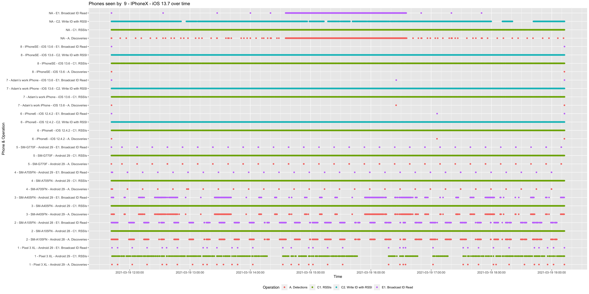

# 2021-03-22

A formal test was carried out for Alberta TraceTogether v2.0 just prior to release. 
With the agreement of Alberta Health the Herald project are publishing the results here.

The test consisted of ten phones. One phone (iPhone7+) failed during the test and has been discounted from the results.
The likelihood is that the true results are, therefore, better than quoted here.

It should be noted that the results on this page are tuned for mobile phone use in Canada whereas all other standard
Herald tests are for the UK.

## Results

|Measure|Result|Notes|
|---|---|---|
|Traceable Interaction Fraction|<b>83.77%</b>|Used as input to OpenABM simulation|
|Overall Efficacy|47.00%|<b>Effective</b> (Canada MAX 55.20%)|
|<i>Probability of detection</i>|87.95%|Formal RISK detection|
|Phone Detection|100%|Includes iOS in the background|
|Continuity|93.19%|Full continuity|
|Completeness RT1|98.36%||
|Completeness RT2|TBD|Not yet calculated from data|
|Completeness CE|95.95%||
|Accuracy|95.95%|RSSI accuracy|
|Longevity|100%|8 hour test|
|Mean time between readings|TBD||
|Country|Canada||
|Have BLE Phones|83.75%|[Statista](https://www.statista.com/statistics/472054/smartphone-user-penetration-in-canada/)|
|Hardware Support|99.18%||
|Software/OS Support|98.40%||
|Overall Pspec|81.73%||
|<i>Pspec squared</i>|66.8%||

## Phones tested

|PhoneId|Phone Make and Model|OS and version|Known issues|
|---|---|---|---|
|1|Pixel 3XL|Android 19||
|2|Samsung A10 (SM-A105FN)|Android 28|A10s knowingly rotate their BLE MAC address with every request. Herald uses an ephemeral ID that rotates every 15 minutes as a performance improvement.|
|3|Samsung A40 (SM-A405FN)|Android 29|Same issue as A10 above|
|4|Samsung A70 (SM-A705FN)|Android 29||
|5|Samsung S10-lite (SM-G770F)|Android 29||
|6|iPhone 6|iOS 12.4.2||
|7|iPhone 7|iOS 13.6|Phone's name is Adam's work iPhone|
|8|iPhone SE 1st gen|iOS 13.6||
|9|iPhone X|iOS 13.7||

## Fair Efficacy Stats Summary

|Phones|Max Pairs|Pairs Detected|Detection Percent|Max 30 second windows|30 second windows achieved|Missed windows percentage|Longevity change over 8 hours|
|---|---|---|---|---|---|---|---|
|9|72|72|100%|70560|65751|6.815476%|0.00%|

## OpenABM Simulation

The below shows the effect on COVID-19 spread of 100% adoption of the application under test, and 80% conformance to self-isolation advice. Note: The simulation still shows a control effect on COVID-19 spread with lower app uptake.

Initial seed data:-

- Alberta population as of 1st Jan 2021 of 4,436,258 - Source: https://www.alberta.ca/population-statistics.aspx
- Alberta current (Day 1) COVID-19 live cases on 18 Mar 2021 of 5,342 - Source: https://www.alberta.ca/coronavirus-info-for-albertans.aspx
- No other sources of control (lockdown, masks, etc.)
- 200 day simulation

## Phone detection and distance estimation reports

The below 9 charts show discoveries, ID (data payload) reads, and RSSI (distance estimation) readings as individual dots.

The below charts show RSSI variation over time. In a formal test these will mostly be static.

