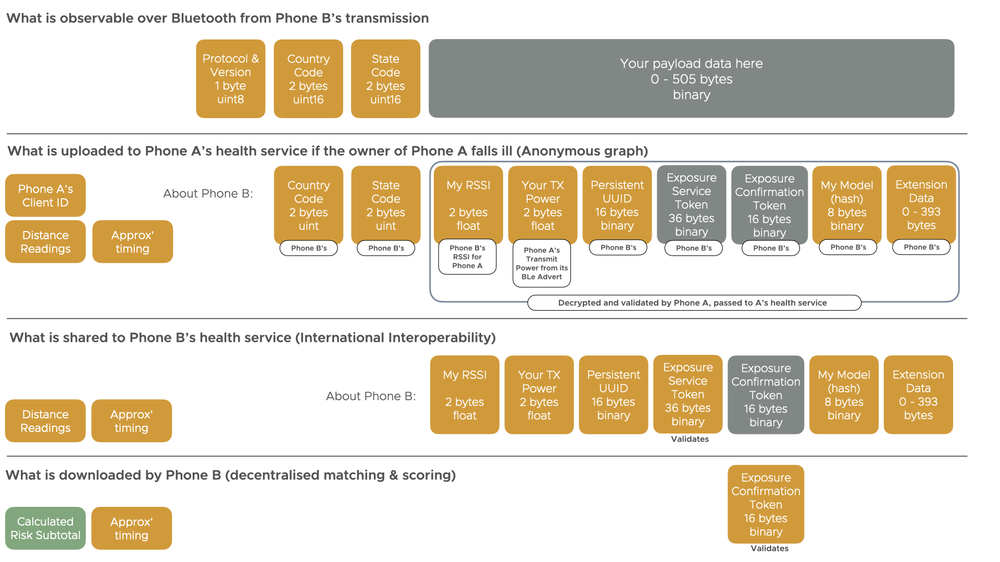

# International Interoperability Specification

This page formally specifies the [International Interoperability]({{"/payload/interop" | relative_url }})
protocol and data payloads.

This specification is a **DRAFT** and is not yet complete.

## Modal verbs terminology

The key words "MUST", "MUST NOT", "REQUIRED", "SHALL", "SHALL 
NOT", "SHOULD", "SHOULD NOT", "RECOMMENDED",  "MAY", and
"OPTIONAL" in this document are to be interpreted as described in
[RFC 2119](https://tools.ietf.org/html/rfc2119).

Note that these terms apply whether they are uppercase or lowercase
and no matter what styles are applied to the phrases.

## Executive summary

Most existing Contact Tracing protocols have no in-built support for either inter-state, international, or
public-private contact tracing system interoperability. When the world goes back to the 'new normal'
and starts to travel again this will mean that cases cannot effectively be traced whilst also
ensuring national soverignty to data protection, health data, and privacy laws.

This International Interoperability standard aims to allow for built-in international interoperability -
whether using the Herald protocol, GAEN, Robert, OpenTrace, or any other contact tracing app protocol. We
shall use these four existing approaches as examples throughour this standards document.

## Introduction

Herald payload standards have built-in support for country and state data payload identifiers in a header
area. Whilst talking with international partners and standardisation organisations around this
support for international interoperability it was suggested that the standard be widened to support other
existing data payloads over Bluetooth to allow each country to interoperate.

This standard presented here is the culmination of that work. We define not only the minimum data for
contact tracing apps themselves to exchange over Bluetooth (or any other technology), but also the
backend healthcare or private systems to interact and exchange exposure details.

Privacy and Security - as well as national sovereignty over laws concerning data protection - are key
items considered in this document.

## Scope

### What is in scope

- Suggested locally transmitted data between apps
- Recommendations for handling digital contact tracing (DCT) detections without this data
- Suggested data upload format for apps to healthcare systems
- Standard for integrating backend healthcare systems to allow contact tracing
- Suggested security mechanisms / checks to be applied at each stage
- Support for both centralised, decentralised, and hybrid contact tracing systems

### What is out of scope

- Individual payload formats for 'over the wire' (or Bluetooth) transmission
- Data payload parsing/handling beyond that required to pass the data packets to the relevant authorities for processing
- Legal analysis for EU GDPR, UK DPA, other other data protection or healthcare compliance

## References

### Normative references

References are either specific (identified by date of publication and/or edition number or version number) or non specific. For specific references,only the cited version applies. For non-specific references, the latest version of the referenced document (including any amendments) applies.

The following referenced documents are necessary for the application of the present document.

TODO insert references

### Information references

References are either specific (identified by date of publication and/or edition number or version number) or non specific. For specific references,only the cited version applies. For non-specific references, the latest version of the referenced document (including any amendments) applies.

The following referenced documents are not necessary for the application of the present document but they assist the user with regard to a particular subject area.

TODO insert references

## Definition of terms, symbols and abbreviations

### Terms

**Beacon** - A fixed device in a location that provides location-specific information. May be called a Bluetooth Beacon.

**Big Endian** - Also known as 'Network Order'. A way of encoding numeric values for transport over data networks. Bluetooth (and most network protocols) are Big Endian.

**Herald Project** - The opensource contributors and maintainers of the Herald website, code, and standards documents.

### Symbols

### Abbreviations

**DCT** - Digital Contact Tracing

**EBID**

## Design Constraints

The below are the constraints placed on the design of the system that the rest of this standard is defined within.

MUST allow for centralised, decentralised, or hybrid DCT system integration.

MUST support multiple DCT data payload formats and sizes

MUST provide secure upload and system-to-system interoperability

MUST ensure the minimum size of information is interchanged so as not to affect data loads on either local
mobile data networks or international internet datalinks.

Individual jurisdictions MUST be allowed to choose the data payload and DCT system most appropriate for their
populations. Private companies MAY provide a DCT system for their employees/customers.

## Core components of a DCT system

**Figure 1**: International Interoperability sequence of events

@startmermaid
sequenceDiagram 
  Phone A->>Health System A: Upload contact events
  Health System A->>Phone A: Upload successful
  Health System A->>Health System B: Forward contacts
  Health System B->>Health System A: Forwarding successful
  Health System B->>Health System B: Validate exposure service tokens
  Health System B->>Health System B: Calculate risk subtotals
  Health System B->>Health System B: Update exposure list
  Phone B->>Health System B: Request exposure list changes
  Health System B->>Phone B: Respond with list changes
  Phone B->>Phone B: Validate exposure confirmation tokens
  Phone B->>Phone B: Increment exposure, check against threshold
  Phone B-->>Phone B: If exceeded, alert user
@endmermaid

In this standards document we consider the following separate areas:-

- Minimum data - Minimum and extended information required for international interoperability
- Device to device - Local detection of 'tokens' (data payloads) for DCT exposure between devices (phones, wearables, and beacons)
- Device to health system - Formats and mechanism for the upload of exposure notification information to a health service
- Health system to health system - Formats and mechanism for health service to health service exposure record sharing
- Security and Privacy architecture - Processing and security steps suggested for each of the above activities

## Minimum information for interoperability

*Informative*: In order for a device user to be informed of their exposure risk and any actions
they need to take to ensure their health, exposure data needs to be transferred to that application
owner. This will necessitate passing this data to the application's provider. For national
systems this will be their local (State or National) health authority. This could also be other
organisations, such as private companies with their own worldwide system. A way is needed to
identify which 'authority' to pass exposure information to, as well as the exposure information itself.

Below are some user stories for each aspect of the system (DCT aspects only, no pre-tracing or post tracing eHealth use cases):-

- As a DCT device end user I would like to detect my proximity to others' nearby so as to allow me to be traced if I'm at risk of infection, allowing me to be rapidly treated
- As a healthcare system provider I need to exchange data with state or international partners in order to cooperate on preventing virus transmission, reducing the spread in to and out of my area
- As a healthcare system provider I have a duty to ensure the minimum data is shared with other providers/jurisdictions in order to achieve my stated health outcome
- As a healthcare system provider I have a duty to ensure that the system provided to my residents allows secure data transmission and validation, and prevent hostile actor attacks (individual targetting, group targetting, undermining confidence in the DCT system, economic damage through DCT system data manipulation)
- As a healthcare system provided I have a duty to ensure data passed to me by devices and other healthcare systems can be validated for authenticity before being acted upon

## Minimum system and data components for interoperability

A DCT system needs:-

- To be able to detect and advertise one or more DCT protocols and payloads (Roaming DCT interoperability)
- To describe detected and transmitted payloads in a way that can be stored and transferred without specific knowledge of every format I may encounter (Forward compatibility)
- To either process the payloads locally or share these intercepted payloads with the device app's healthcare provided for actioning (decentralised and centralised matching)
- To interpret this data to determine risk of infection or infection spread (risk estimation, infection graph analysis)
- To notify a DCT user of any risk or pro-active measure that needs to be taken (exposure notification)

In order to do this the payload exchanges - whether done via advertising only or connection based protocols - must have a common mechanism and common format.

### Common mechanisms

There are two mechanisms in use via Bluetooth. Future standards may apply the same principles to other technologies (E.g. UWB).

1. Advertising-only - provides a 'broadcast' of an EBID from any device that supports advertising
2. Connection based - allows EBID data to be encrypted to prevent interception (and thus prevent replay and relay attacks)

Both of these approaches have pros and cons that are not enumerated in this standard. Both approaches should be supported in this standard.

### Exposure header

Whichever method is used the data exchanged needs to have some commonality after decoding. 
This data shall be called for the remainder of this standard the 'exposure header'.

The DCT payload MUST include a payload version code value first to indicate how the remainder of the
payload is interpreted. This version identifier MAY be a rolling version idetifier that repeats after a number
of versions. (I.e. 0, 1, 2... 7, then 0 again for the next version).

It is RECOMMENDED that this payload and version code
be a 1 byte uint8 that uniquely identifies the version of the payload being used. (E.g. see the list of protocols supported
in the Herald Data Envelope and used in the Simple and Secured payload standards). This identifier SHOULD be the only part
of the data payload used to detect or infer the payload and version. (I.e. no 'payload sniffing' is required by looking
at the rest of the data payload)

A routing code MUST be provided next to indicate the authority responsible for issuing or handling exposure notifications for this payload.

For nation/state authority systems this routing code MUST be a country identifier followed by a state/authority identifier within that country.

If the payload code and version specifies a non-state controlled mechanism, than this data area is interpreted as one field to identify the managing authority.

It is RECOMMENDED that ISO-3166-1-Numeric (not text) be used for the country code. It is further RECOMMENDED that this
be represented as a 2 byte uint16.

TODO recommend a code 'country code' for 'international, or standards body' use.

It is RECOMMENDED that the state code be a 2-byte identifier assigned by the country also included in a data exchange.
It is further RECOMMENDED that this be represented as a 2 byte uint16. It is also RECOMMENDED that the value 0 be reserved to indicate the 'national' system

**NOTE**: This 0 code allows a single routing authority or fallback option allowing delegation to or centralisation of authority over time with a predictable identifier.

A diagram showing this exposure header is below:-

**Figure 2. Exposure Header format**

@startmermaid
graph LR
  A(Payload Type and Version 1 byte 0x00-0xFF _) --> B(Country Code 2 bytes uint16 _)
  B-->C(State /  Authority Code 2 bytes uint16 _)
  C-->D(Contact event Data 1+ bytes binary _)
@endmermaid

### Minimum contact event information

A Contact Event MUST include the date the contact happened, and MAY include the exact or approximate time
of the contact event. 

A Contact Event SHOULD include a start time and end time.

The exact times (start and end), but not dates, of a contact event MAY be modified on forward transmission from a DCT app in order to prevent contact network de-anonymisation.
Such a modification MUST hold an accurate duration so as not to invalidate its use for risk estimation.

**NOTE**: It should be noted that any modification to a contact event start and end time could lead to an incorrect estimation of exposure risk, with more modification
leading to more false positive and false negative exposure notifications. Implementors SHOULD NOT modify this if they can help it. Any modification will also
potentially cause people present at venues at these altered times to be incorrectly linked to the index case, causing false positive notifications of exposure.

### Extended information for interoperability

This sub-section of this document describes elements that are optional. This data does not form part of the 'Exposure header'.

The following information MAY be parsed by a health authority from the rest of the payload information beyond the header in order to provide for more accurate risk estimation.

The Contact Event MAY include a set of distance readings or a distance analogue (such as RSSI) or information useful for distance conversion (TxPower, Phone Model).

The Contact Event MAY include an authentication token used by an authority to verify that the data was securely exchanged by a valid app from a DCT authority. (E.g. Herald Secured Payload)

The Contact Event MAY include an authentication token used by a DCT app to verify that the data was securely exchanged by itself and represents a valid exposure. (E.g. Herald Secured Payload)

If authentication data is provided then it SHOULD be validated by the DCT authority or DCT app at the appropriate time.

### Epidemiological needs

Any protocol SHOULD provide data of use to epidemiologists. In particular the following section details minimum performance criteria known from the academic literature.

A DCT app SHOULD perform distance estimation (i.e. RSSI readings) between devices at least once every 30 seconds within the range of potential transmission. (Fowler, 2020)

A DCT app system SHOULD perform exposure notification to a DCT app user within 4 hours of a known confirmed case of COVID-19. (Ferreti et al, 2020)

A DCT app system MAY allow for second-degree contact exposure notification (i.e. notifying contacts-of-contacts when someone falls ill). (Ferreti et al, 2020)

A DCT app system MAY allow for data analysis to spot asymptomatic and super spreader carriers and provide them with health advice. (Ferreti et al, 2020)

TODO link above references

## Roaming detection of DCT exposure payloads

DCT exposure data are sometimes called 'tokens' or 'data payloads'. In this document we shall use payload as
a payload may include more information than just a token.

No matter what protocol is used to exchange a DCT exposure payload this data MUST be detectable by other apps
without specialist centralised security tokens. They MAY use locally generated, ephemeral, security tokens
to protect the transmission from interception. (Note: This prevents closed proprietary systems from preventing
exposure detection, and prevents vendor lock-in.)

**TODO DIAGRAM OF TWO PHONES EXCHANGING DATA**

A DCT app MAY support both detection and provision of exposure data payloads for multiple versions of the same
protocol, or for multiple protocols. 

**NOTE**: The above provides flexibility to migrate between protocols or protocol versions over time.

A DCT app supporting one protocol to notify others of its presence MAY support the detection of exposure data payloads
from other protocols or technologies that can be detected by this app.

Local exposure data payloads SHOULD include the protocol type and version, country, and state/authority information
detailed in the previous section of this standard. (i.e. the exposure header). Where provided, this data MUST be
the first part of a data payload exchange.

Where an exposure header is not provided the detecting DCT app SHOULD presume this is the Country and State within
which the DCT app is currently located (E.g. if visiting England, this will be 'UK' and 'NHS England'). The DCT
app SHOULD NOT infer the protocol type and version and instead leave this up to the health authority the information
is later passed to.

These data payloads MUST be logged locally by the detecting DCT app.

An example set of detected payloads from a single app is shown below. See Annex D for protocol version codes.:-

**Figure 3. Example contact event log**

@startmermaid
graph LR
  T1(Date time 10 Dec 20 09:36-10:15 _) -> A
  A(Payload Type and Version 1 byte 0x00 Herald Simple V1 _) --> B(Country Code 826 UK _)
  B-->C(State/Authority Code 1 _)
  C-->D(Contact event Data 16 bytes Simple token _)

  T2(Date time 10 Dec 20 10:36-10:50 _) -> A
  F(Payload Type and Version 1 byte 0x00 Herald Simple V1 _) --> G(Country Code 826 UK _)
  G-->H(State/Authority Code 1 _)
  H-->I(Contact event Data 16 bytes GAEN token _)

  T3(Date time 10 Dec 20 12:31-13:30 _) -> A
  J(Payload Type and Version 1 byte 0x00 Herald Simple V1 _) --> K(Country Code 250 France _)
  K-->L(State/Authority Code 3 _)
  L-->M(Contact event Data ? bytes Robert v2 token _)
@endmermaid

### Advertising-only detection mechanism

For advertising-only payloads the following interoperability protocol MUST be supported.

A device MUST advertise via a long code service UUID of [TODO - confirm if compatible with Herald's existing service mechanism]
short code service ID of [To be assigned by Bluetooth SIG] with service data area containing
the payload. The first bytes of the payload MUST be as per the above exposure header.

TODO EXAMPLE PAYLOAD BYTES FROM WIRESHARK CAPTURE OF REFERENCE IMPLEMENTATION, AND OTHER EXISTING PROTOCOLS/PAYLOADS.

A DCT app MAY record the RSSI information from these adverts in order to provide distance and risk estimation
functionality.

A DCT app MAY support both adveritising and connection based mechanisms.

A DCT app SHOULD record the first interaction date and time with this device and last interaction time (MAY be done by first and last advert seen time).

TODO complete this section with payload-independent activity diagram

### Unencrypted connection-based detection mechanism

TODO description of existing mechanisms as used by ROBERT, OpenTrace, COVIDSafe v2.0, Herald et al.

TODO complete this section with payload-independent activity diagram

### Secured Connection-based detection mechanism

For connection-based detection the following mechanism MUST be supported.

A DCT app MUST advertise a write-with-response characterisation with long code UUID of
or short code ID of [To be assigned by Bluetooth SIG], with no initial value.

A DCT app MUST connect to this device and write their supported payload version, routing
code, and initial public cryptographic material. See FIG X BELOW

TODO FIG X - connection exchange loop

The DCT app receiving the write MUST perform a Diffie-Hellman key exchange, and respond
with their exposure header, followed by their public cryptographic material, followed by their
encrypted payload response.

The originating DCT app SHOULD then perform another write-with-response, this time using the
public cryptographic material from the other phone with a new public cryptographic material
from itself, and write the exposure header, public crypto material, then its own encrypted
exposure data.

The keys for this exchange MUST NOT be reused.

This exchange MAY happen in reverse also.

**NOTE**: Allowing this in both directions avoids the problem of one-way detection, and
works around devices that do not support advertising themselves, or whose advertising
functionality on the device has failed. (An occurence possible on Android phones).

Whilst the connection is open the DCT apps MAY use the data channel RSSI for distance and risk estimation.

A DCT app SHOULD close the connection as soon as possible, but MAY keep it open to
provide data channel RSSI if this device's advertisement (and thus advert RSSI) has not
yet been detected.

**NOTE**: This scenario is possible at range, in crowded situations, or with older phones that do not support advertising.

A DCT app SHOULD use the minimum number of concurrent connections possible.

A DCT app MAY support both adveritising and connection based mechanisms.

TODO complete this section with payload-independent activity diagram

## Uploading contact event information from a device to a health authority

It should be noted that whilst mobile phones may have data upload capability, 
wearable devices might not. A mobile phone may also be in roaming mode
until returning to its country of origin, and so data upload and notification 
may be delayed.

This makes it necessary to discuss upload and sharing mechanisms and
timeliness.

A DCT app SHOULD keep contact events locally on the phone until there
is a need for them to be shared. 

A DCT app MAY encrypt this contact log such that only the app's healthcare system can decrypt the log, so
as to prevent compromise or analysis by a hostile actor (E.g. hacker, domestic abuser)

A DCT app MAY upload contact events constantly, rather than only on confirmation a person has fallen ill.

**NOTE**: Proactively sharing contact events may be a privacy concern
and will have a detrimental affect on bandwidth use.

**NOTE**: A reason for sharing contact data might be a positive
test for a disease, hospitalisation, taking part in a medical study 
on asymptomatic contact networks, or being symptomatic.

Once a positive case is confirmed then contact events MUST be shared
as soon as possible to the health service.

**NOTE**: Ferreti et al 2020 shows that to prevent onward transmission
of COVID-19, notification to enable a contact to self isolate MUST occur
within 4 hours of the case being confirmed. See the Epidemiological needs section.

TODO individual contact event upload mechanism data format

TODO set of contacts encapsulation of the above data

TODO response format and actions (E.g. deletion locally)

### Upload RESTful API specification

This section between a state's app and its servers is INFORMATIONAL and OPTIONAL. States are free internally
to use whichever mechanisms they want. It should be noted that using a standard mechanism will allow
independently created applications to be 'plugged in' to such health systems, providing consumers with
the choice as to the application vendor to use independent of the health authority in that country.
This may be desirable for individuals and groups who want to design an app independent of their
health authority, or for commercial organisations that wish to offer value-add services beyond DCT.

TODO API specification here (optional spec)

## Health authority to health authority exchange

A health authority SHOULD only pass on a date, risk type and score incurred, risk mechanism description,
and advertised payload data from the receiving health authority's app to the receiving health authority.

A health authority MUST pass on information about confirmed cases as soon as it has been processed and the destination for the notification ascertained. (See Ferreti et al, 2020)

TODO citation link for the above

The health authority needs to:-
- Correctly identify the URL for the health service to handle the data to send on
- Correctly determine the exposure notification endpoints and protocols supported
- Send on the exposure notification information
- Confirm the information was successfully received
- Determine what to do with information for other authorities in terms of storage and deletion

### RESTful API for health authority interoperability

The following endpoints MUST be supported between health authority systems:-

- GET /resolver - Retrieve supported settings and resolution information for this system (may be the central country system)
- GET /resolver/COUNTRY/STATE - Retrieve the list of settings and supported operations for this country/state for THIS client request
  - Lists the resolver main URL for the given country and state, with backups, highest priority first
- POST /exposure/COUNTRY/STATE - Send exposure information for a contact to its parent country/operating authority
- POST /exposure/COUNTRY/STATE/VENUECODE - Send venue exposure information to its parent country/operating authority

All the above methods MUST allow requests encoded as either application/json or application/octet-stream.

The request MAY be gzip encoded as per normal HTTP headers.

The exact security mechanism and endpoint protection is left to the responsible organisation,
but it is RECOMMENDED that this be via a mutual TLS v1.2 or above based mechanism with ECIES P256.

The API is HATEOAS in its response format.

#### octet-stream format

TODO full description referring to which pieces of the decrypted data exchanged from the device
should be sent on to the transmitting apps' health authority. Include which fields must not be shared.

#### JSON format

The following table maps raw octet fields on to their equivalent JSON document fields

|Octet-field|JSON field|Format conversion|
|---|---|---|
|TODO complete table|

#### Sample requests and responses

See Annex E for sample requests and responses.

TODO interaction flow diagram for authority to authority exchanges.

TODO talk about TCP keepalive, streaming options, etc.

## Annex A (Informative): Bibliography

Links to prior art and further reading

## Annex B (Informative): Figures 

The below figures are also shown inline within the standard document.

**Figure 1**: International Interoperability sequence of events

@startmermaid
sequenceDiagram 
  Phone A->>Health System A: Upload contact events
  Health System A->>Phone A: Upload successful
  Health System A->>Health System B: Forward contacts
  Health System B->>Health System A: Forwarding successful
  Health System B->>Health System B: Validate exposure service tokens
  Health System B->>Health System B: Calculate risk subtotals
  Health System B->>Health System B: Update exposure list
  Phone B->>Health System B: Request exposure list changes
  Health System B->>Phone B: Respond with list changes
  Phone B->>Phone B: Validate exposure confirmation tokens
  Phone B->>Phone B: Increment exposure, check against threshold
  Phone B-->>Phone B: If exceeded, alert user
@endmermaid

**Figure 2. Exposure Header format**

@startmermaid
graph LR
  A(Payload Type and Version 1 byte 0x00-0xFF _) --> B(Country Code 2 bytes uint16 _)
  B-->C(State /  Authority Code 2 bytes uint16 _)
  C-->D(Contact event Data 1+ bytes binary _)
@endmermaid

Figure 1. International Interoperability flow diagram

Figure 2. Contact event upload data format (optional)

TODO

Figure 3. Contact event sharing data format (required)

TODO

## Annex C (Informative): Change history

|Date|Author|Change summary|
|---|---|---|
|2021-01-18|[Adam Fowler](https://github.com/adamfowleruk/)|Added Bluetrace encoding example to Annex|
|2020-12-22|[Adam Fowler](https://github.com/adamfowleruk/)|Issues and basic mechanism documented (Valid for Herald v1.2)|
|2020-12-04|[Adam Fowler](https://github.com/adamfowleruk/)|Initial draft content|

## Annex D: Assigned payload and version codes

|Code range|Payload|Notes|
|---|---|---|
|0x00-0x07|Custom - 4 byte routing code. Independent of nation states|Does not require formal assignment.|
|0x08-0x0F|Custom - 2 byte country code, 2 byte state identifiers managed by country (0 reserved for 'national')|Does not require formal assignment.|
|0x10-0x17|Herald Simple Payload - Advertisement or connection based|Fixed 5 byte header (compliant with this standard), 16 byte data payload|
|0x18-0x1F|Unassigned but reserved||
|0x20-0x27|Herald Secured Payload - Connection based|Fixed 5 byte header (compliant with this standard), variable 65 byte+ data payload|
|0x28-0x2F|Unassigned but reserved||
|0x30-0x37|Herald Venue Check-in Payload - Advertisement or Connection based|Fixed 5 byte header (compliant with this standard), variable 4 byte+ data payload|
|0x38-0x7F|Unassigned but reserved||
|0x80-0x87|GAEN - Advertisement only|No header, fixed 16 byte data payload (Chirp)|
|0x88-0x8F|Robert (France) - Connection based only|No header, data payload TBC|
|0x90-0x97|Open Trace - Connection based only|No header, data payload TBC. Many variants with different data payloads. (E.g. Singapore, Australia) 0x90=standard bluetrace encoding, 0x91=Herald binary encoding (See annex E)|
|0x98-0x9F|DP3T - Advertisement only|No header, 2 byte data payload (TBC)|
|0xA0-0xA7|PACT (MIT) - Advertisement only|No header, fixed 28 byte data payload (Chirp)|
|0xA8-0xFF|Unassigned but reserved||

## Annex E: Herald payload encoding examples

To aid implementors below are examples of the Herald payload encoding for a variety of DCT payloads types.

### Bluetrace: Basic encoding

This encoding uses the same over the air format as standard BlueTrace, but prepends the data with
a Herald DCT header.

An example is below:-

@startmermaid
graph LR
  A(Protocol Version 1 byte 0x90 _) --> B(Country   2 bytes 826 _) --> C(State      2 bytes 4 _) --> D(Length uint16_t 2 bytes 55 _) --> D2(Base64 Data String with uint16 length 3+ bytes 53, BD7GJW9FG... _) --> E(Extension Data 0+ bytes As below _)
  I(None by default _)
@endmermaid

Note: It is valid to also use the extended fields here. Hence the two 'length' fields, above

### Bluetrace: Binary encoding

This encoding maps BlueTrace fields on to Herald fields, and greatly reduces the overall
over the air and storage data size requirements for no loss of data.

Firstly we map BlueTrace fields on to Herald fields.

|Bluetrace JSON field|Equivalent Herald field|
|---|---|
|v (version) E.g. v2|Protocol Version E.g. 0x91 (up to 0x97)|
|org E.g. GB_en|Country and State code E.g. 826 and 4|
|txPower|Extended 0x41 - txPower field|
|rssi|Extended 0x40 - rssi field|
|modelC E.g. iPhone6|Extended 0x42 model code E.g. iPhone7,2 (This is the manufacturer code for iPhone6)|

The final binary representation will be around 27 bytes, depending on ID and phone model length, as in the below figure:-

@startmermaid
graph LR
  A(Protocol Version 1 byte 0x91 _) --> B(Country   2 bytes 826 _) --> C(State      2 bytes 4 _) --> D(Length uint16_t 2 bytes 22 _) --> D2(ID String with uint16 length 10 bytes 8, AB123456 _) --> E(Extension Data 15 bytes As below _)
  I(Code 0x40 Your RSSI _)-->J(Length 1 _)-->K(int8_t -56 _)
  F(Code 0x41 Your TxPower _)-->G(Length 2 _)-->H(uint16_t 12 _)
  L(Code 0x42 My Device Model _)-->M(Length 9 _)-->N(utf-8 iPhone7,2 _)
@endmermaid

Note: You may also wish to include fields 0x01 (RSSI method - raw, mean, etc) and 0x02 (Error bound +/- uint8).
See the [Payload Extended Specification]({{"/specs/payload-extended" | relative_url }}) for details.

