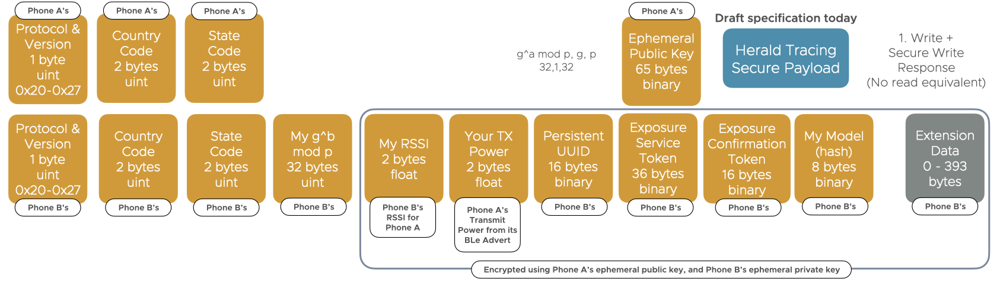
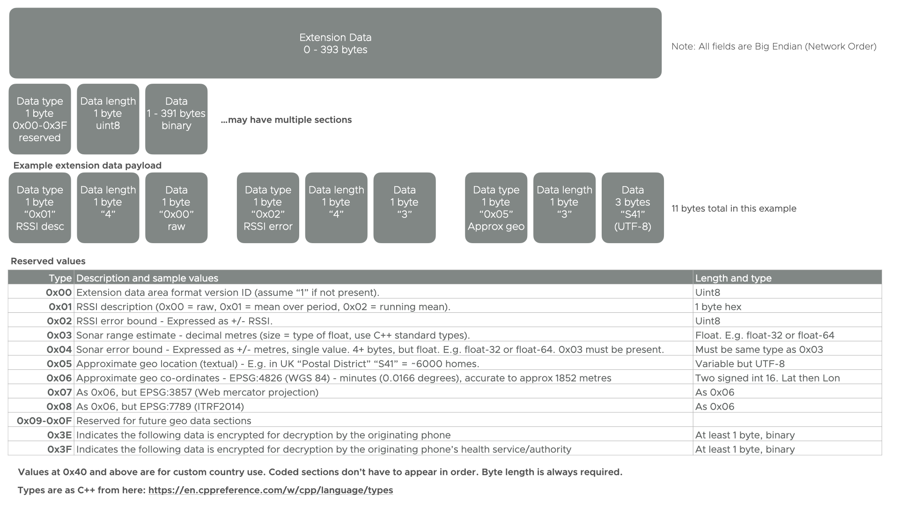

# Secured Payload Specification

This page formally specifies the [Secured Payload]({{"/payload/secured" | relative_url }}).

This specification is a **DRAFT**

## Contents

**NOTE:** No contents or formal notation as of yet. Placeholder content until formal spec format decided.

## Modal verbs terminology

The key words "MUST", "MUST NOT", "REQUIRED", "SHALL", "SHALL 
NOT", "SHOULD", "SHOULD NOT", "RECOMMENDED",  "MAY", and
"OPTIONAL" in this document are to be interpreted as described in
[RFC 2119](https://tools.ietf.org/html/rfc2119).

Note that these terms apply whether they are uppercase or lowercase
and no matter what styles are applied to the phrases.

## Executive summary

## Introduction

## Scope

What is in scope

What is out of scope

## References

### Normative references

References are either specific (identified by date of publication and/or edition number or version number) or non specific. For specific references,only the cited version applies. For non-specific references, the latest version of the referenced document (including any amendments) applies.

The following referenced documents are necessary for the application of the present document.

### Information references

References are either specific (identified by date of publication and/or edition number or version number) or non specific. For specific references,only the cited version applies. For non-specific references, the latest version of the referenced document (including any amendments) applies.

The following referenced documents are not necessary for the application of the present document but they assist the user with regard to a particular subject area.

## Definition of terms, symbols and abbreviations

### Terms

**Beacon** - A fixed device in a location that provides location-specific information. May be called a Bluetooth Beacon.

**Big Endian** - Also known as 'Network Order'. A way of encoding numeric values for transport over data networks. Bluetooth (and most network protocols) are Big Endian.

**Herald Project** - The opensource contributors and maintainers of the Herald website, code, and standards documents.

### Symbols

### Abbreviations

## Payload Design Constraints

The below are the constraints placed on the design of the system that the rest of this standard is defined within.

## Overview of Roles in transmission

The detailed explanation is below:-

The [Transmitting]({{"/background/glossary" | relative_url }}) phone know:-

- It's own master identity symmetric key/UUID (Agreed via Diffie-Hellman-Merkle with healthcare central system)
- It's health authorities public key for any given day
- It's own ephemeral (Bluetooth) pubic/private key pair for this single exchange
- It's own exposure confirmation public/private key pair for this day
- It's own persistent UUID
- It's own geo-approximator (E.g. postal district in the UK - 10000 households on average)
- It's own phone make and model identifier string
- The receiver's ephemeral public key for this single exchange

The [Receiving]({{"/background/glossary" | relative_url }}) phone knows:-

- The transmitter's ephemeral public key
- The transmitter provided exposure service token for the transmitter's health authority, which it cannot decrypt, secured with the daily server public key, which includes:-
  - Transmitter's persistent UUID (16 bytes)
  - Geo-approximator for the transmitter (4 bytes)
  - Transmitter phone make and model identifier (8 bytes)
  - TOTP token for the transmitter's persistent UUID (4 bytes)
- The transmitter provided exposure confirmation service token, which it cannot decrypt, can only be decrypted by the transmitter's confirmation private key, but which contains:-
  - ClientID of the receiver (16 bytes)
- The transmitter's country and state codes (allowing passing of exposure data to this health authority)

The Transmitter's health authority knows, from the transmitter:-

- The transmitter's master identity symmetric key/UUID (agreed via Diffie-Hellman-Merkle)
- It's own daily exposure submission public/private key pair

The Receiver's health authority knows, from the receiver:-

- The transmitter's exposure service token, for this receiver at this time, which it cannot decrypt
- The transmitter's exposure confirmation token, for this receiver at this time, which it cannot decrypt
- The transmitter's country and state codes (allowing passing of exposure data to this health authority)
- The date (and potentially time - NOT recommended) of the contact as observed by the receiver (optional, depends on receiver's app configuration)
- Optionally (but NOT recommended - here in case of a bad actor country using the payload) the transmitter's ephemeral public key as observed by the receiver, which is why this should be rotated per contact
- Date of contact and its distance RSSI info

The transmitter's health authority is told by the receiver's health authority:-

- Receiver phone make and model only
- Transmitter's exposure service token, and decrypts it, revealing:-
  - Transmitter's persistent UUID (which it CANNOT identify the owner of)
  - Geo-approximator for the transmitter
  - Transmitter phone make and model identifier
  - TOTP token for the transmitter's persistent UUID
- Transmitter's exposure confirmation token, which it cannot decrypt

The transmitter's health authority posts the below to all phones it manages (MUST BE WITHIN 30 MINUTES):-

- Transmitter's exposure confirmation token
- Date of the contact event
- Risk accrued score associated with it
- TOTP token for the transmitter's persistent UUID
- Date time this data was posted

The transmitter can now:-

- Recognise and decrypt its own exposure confirmation token, extracting:-
  - Country Code, State Code, ClientID of the receiver, which it verifies the date and time of with its history record
  - Transmission datetime from unix epoch
- Verify that the server decrypted TOTP for it's persistent UUID matches the time of the exposure confirmation token (thus verifying ALL THREE participants, transmitter, receiver, transmitter health authority)
- Use the risk score to calculate the locally acrued risk for a given date/set of days, and see whether it breaches the risk threshold
- Notify it's health authority that they have breached the risk threshold, ideally not immediately after receiving the latest exposures keys (MUST be within 3hrs 30 mins, and should take the posting date time in to account)
  - May also share the person's total risk score for the last 7-14 days

Other receiving phones receive from the exposure download list:-

- Date and time the exposure list was last updated
- Transmitter's exposure confirmation token, which it cannot decrypt
- Contact event date
- Risk score for this unknown transmitter in the contact event
- TOTP token for the transmitter's persistent UUID, which it cannot use as it doesn't know the associated transmitter persistent UUID

A random bluetooth sniffer sees:-

- Date and time the transmission was intercepted
- Ephemeral public keys for receiver and transmitter, which it cannot use as it doesn't have the private keys
- Encrypted data exchanges between the two phones, including the health exposure service token and exposure confirmation token, which it cannot decrypt
- Country and State code for receiver and transmitter
- Any random Bluetooth data being advertised by that phone (E.g. 15 min rotating BLE mac address, "Adam's iPhone" name, FindMyPhone or other manufacturer specific data)
   - On some phones this includes the TX power of the advertiser (transmitter)
- It can calculate it's own RSSI to each device, but not see the RSSI between the two devices

## Assumptions

Health authority and mobile device have a way to rotate and fetch server public/private keys and symmetric key exchange should the server keys become compromised.
This is down to the national health authority to implement in their own app.

## What attacks does this prevent?

- Westminster/hospital attack - Where a state actor can generate a large set of fake device 
registrations and intercept a set of identifiers that it claims it, itself, received. This
prevents locking down of specific, targetted, areas so long as a large 'spike' of
notifications from a single source is trapped.
- Relay attacks - cannot work as the entire contact chain is verified by the transmitter
- Replay attacks - Comms are encrypted, and pub/priv keys are one time use, preventing valid replays
- Compromise of networking between mobile and its health authority. E.g. impersonation of network device in the chain, post registration

## Where did this idea come from?

A mix of :-

- Kerberos ([RFC 4120 (external link)](https://tools.ietf.org/html/rfc4120)); and 
- Time base one time password - TOTP ([RFC-6238 (external link)](https://tools.ietf.org/html/rfc6238)); and
- Diffie-Hellman-Merkle key agreement ([RFC-2631 (external link)](https://tools.ietf.org/html/rfc2631)).

Diffie-Hellman-Merkle should be used over an encrypted channel between each mobile phone app and its health authority to exchange cryptographic material between
mobile and health authority servers that allow a mutually agreed symmetric key to be created without interception. This key is used
to secure all communication between mobile and health server, like a password, but instead of directly being used should be used with TOTP to generate a one time use key per request. 
This prevents well funded actors breaking Diffie-Hellman-Merkle protected exchanges through pre-calculation of factors as they do not know the mutually agreed epoch.
In the same way a client UUID can be generated.

Optionally, in a very centralised system with lower privacy guarantees, the rotation key (TOTP password) derived from this symmetric key is used as the transmitter persistent UUID (NOT the bluetooth ClientID).
This should not be necessary, however, as all epidemiological data is provided without this needing to be done.

Time based one-time password is used in several areas, but with different source material:-

- To secure comms between a mobile device and its health authority server directly
- To generate a one time use exposure confirmation code allowing a mobile device to verify any received exposure keys
- To provide the transmitter's health authority, via the receiver and its health authority, with an encrypted verification code, allowing receiver and server to be verified in the eyes of the transmitter when an exposure notification is received

Kerberos was used as inspiration for the method of token passing and validation without 
communication between the health authority and trasmitter each time (and thus loss of privacy). 
The difference here is that each transmitter, NOT the health authority server, acts as its 
own authentication authority, and treats the health authority it belongs to as a 'Service' 
provider (hence the term exposure service token). 

The transmitter also treats itself as a service 
provider, so it can verify the exposure record later on.
The receiver phone is regarded as a 'client' of both the transmitter and health 
authority exposure notification service.

## Extensions

Given that enough contact graph data is known by the health authority it would 
be possible for it to identify asymptomatic people and super spreaders.
In this scenario the health authority would have to add a different 
notification list where the exposure confirmation token was verifiable
as being from the health authority server. 

This would of course potentially
identify this transmitter as the hitherto anonymous end of the contact graph, 
identifying both ends of the contact event and linking the persistent UUID 
forever to a known real transmitting device, if both transmitter and receiver are 
from the same health authority.

It is important, therefore, that when an app becomes aware of being dangerously exposed,
or notified that its user could be a super spreader, that it doesn't immediately
declare itself as in this state. It should lag this status update by a random time period
of up to 30 minutes.

## Annex A (Informative): Bibliography

Links to prior art and further reading

## Annex B (Informative): Figures 

The below figures are also shown inline within the standard document.

Figure 1. Secured Payload Contents

Figure 2. Extension Data Area Contents

Figure 3. Knowledge graph

## Annex C (Informative): Change History

The below is the version history:-

|Date|Author|Change summary|
|---|---|---|
|2020-12-03|[Adam Fowler](https://github.com/adamfowleruk/)|Initial very draft content|
